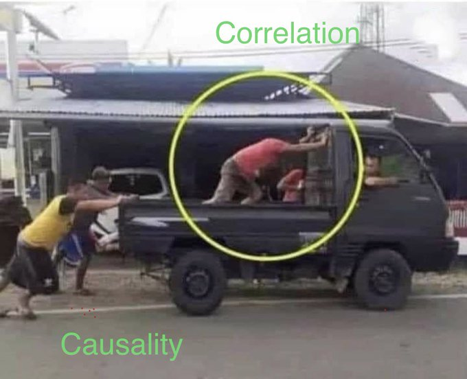
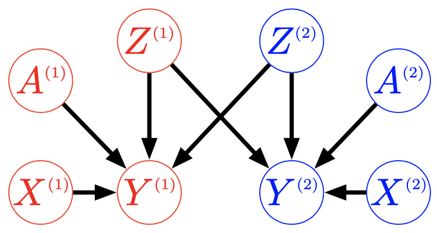
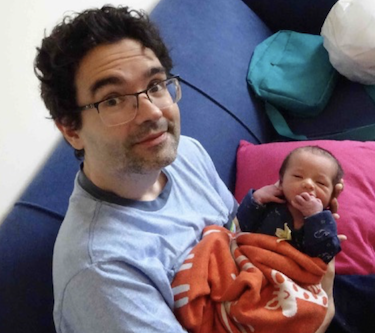

class: inverse

```{r setup, include=FALSE}
options(htmltools.dir.version = FALSE)
knitr::opts_chunk$set(fig.retina = 3, warning = FALSE, message = FALSE)
options(knitr.table.format = "html")
```

```{r xaringan-themer, include=FALSE, warning=FALSE}
library(xaringanthemer)
style_duo_accent(
  primary_color = "#2d708e",
  secondary_color = "#230433",
  link_color = "#55c667",
  text_bold_color = '#f68f46',
#  title_slide_text_color = "#444444",
  title_slide_background_color = "#ffffff", #"#042333",
  title_slide_background_image = "../../../files/theme/LSE/LSEcrest_large.jpg",
  title_slide_background_size = "cover",
  ) #or contain
```

```{r xaringanextra, include=FALSE, warning=FALSE}
library(xaringanExtra)
#xaringanExtra::use_animate_all("slide_left")
xaringanExtra::use_tile_view()
xaringanExtra::use_panelset()
xaringanExtra::style_panelset_tabs(font_family = "inherit")
```

```{r tidyverse, include=FALSE, warning=FALSE}
library(tidyverse)
library(knitr)
theme_set(theme_minimal(base_size = 22))
set.seed(1)
library(broom)
library(modelr)
```

<style type="text/css">
.remark-slide-content {
    font-size: 1.2rem;
    padding: 1em 4em 1em 4em;
}
</style>

### High level intro

Causality, what is it good for?

### Causal fairness

In prediction and ranking tasks, and with **intersectionality**

### Designing interventions

Optimal fair policies, causal **interference**

### Concluding thoughts

---

Tech solutionism, using ML/AI in [every situation](https://twitter.com/whitesphd/status/1308094245669081089)



---

#### Imagination

Albert Einstein:

> Imagination is more important than knowledge. For knowledge is limited, whereas imagination [...] stimulat[es] progress, giving birth to evolution.

Stephen Jay Gould: 
> I am, somehow, less interested in [...] Einstein’s brain than [that] people of equal talent have lived and died in cotton fields and sweatshops.

David Graeber: 

> the ultimate, hidden truth of the world is that it is something that we make, and could just as easily make differently

---
class: inverse

#### Science fiction

[Anxiety Is the Dizziness of Freedom](https://onezero.medium.com/anxiety-is-the-dizziness-of-freedom-b5ab45cae2a5), story by [Ted Chiang](https://www.buzzfeednews.com/article/tedchiang/the-real-danger-to-civilization-isnt-ai-its-runaway)


(Art: [Jinhwa Jang](https://www.jinhwajangart.com/))

---

Fictional technology, like the "universe splitter" [app](http://cheapuniverses.com/) combined with a messenger

> prism created two newly divergent timelines, one in which the red LED lit up and one in which the blue one did, and it allowed communication between the two

Experiments with both potential outcomes observed?! No...

> Every branch was of paramount importance to its inhabitants; no one was willing to act as a guinea pig for anyone else.

> What prisms did offer was a way to study the mechanisms of historical change. Researchers began comparing news headlines across branches, looking for discrepancies and then investigating their causes.


---

## Why is causality important?

.pull-left[

ML models have hitherto only predicted the world in various ways; [the point is to change it](https://en.wikipedia.org/wiki/Theses_on_Feuerbach)

]
.pull-right[


([Evolutionary](https://en.wikipedia.org/wiki/Causal_reasoning#Causal_reasoning_in_non-human_animals) explanation?)
]

---

### Berkeley graduate admissions example

> The bias in the aggregated data stems **not from any pattern of discrimination on the part of admissions committees**, which seem quite fair on the whole, but apparently from **prior screening at earlier levels** of the educational system. Women are shunted by their **socialization and education** toward fields of graduate study that are generally more crowded, less productive of completed degrees, and less well funded, and that frequently offer poorer professional employment prospects.

From the final paragraph of Bickel et al (1975)

---

### Directed Acyclic Graph (DAG) models


- Assumption: directed paths show conditional dependence
- Assumption: intervention to change one variable also affects all variables on paths away from it

---

## Two interpretations

### Interventions

Can we change socialization/education, for example including more women role models in STEM curricula?

### Counterfactual fairness

I was admitted to grad school. *If I had been a different gender*, maybe I would have applied to a different department and not been admitted... *Is that fair*?


---
class: inverse

# Bet on causality

My claim: **fairness**, combined with a **focus on causality**, orients us toward discovering and mitigating the **root causes**

In particular, it will:

- expose flaws in the *status quo* application of fairness concepts like **merit** / just deserts

- show how to better operationalize those concepts

- bridge the "merit" and consequentialist approaches

---


### Interventions, counterfactuals, thought experiments

- Pearl's [ladder of causation](https://en.wikipedia.org/wiki/Causal_model#Ladder_of_causation) level 2

Intervention, action, manipulation, policy change

*What will (or is more likely to) happen if...*

- But we can also go to level 3

Counterfactuals, potential histories(?)

*What would have (been more likely to have) happened if...*

- Thought experiments

Models as thinking tools, *over-simplified models as diagnostics for more realistic ones*

---

### Statistical wisdom: models as (thinking) tools

.pull-left[

[George Box](https://en.wikipedia.org/wiki/George_E._P._Box)
]

.pull-right[

> [All models are wrong](All_models_are_wrong) but some are useful

therefore,

> ... the scientist must be alert to what is **importantly wrong**

> ... **cannot obtain a "correct" one** by excessive elaboration

]


---

[Imbens (2019)](https://siepr.stanford.edu/sites/default/files/publications/19-022.pdf) on DAGs, reviewing The Book of Why:

>  TBOW and the DAG approach fully deserve the attention of all researchers and users of causal inference as one of its leading methodologies.

DAGs conveniently express some things but not others

> In economics the endogeneity often arises from agents actively making choices regarding the causal variable on the basis of anticipated effects of those choices

DAGs and Potential Outcomes are both useful

> identification results are also easier to derive in the PO framework

- What's **importantly wrong** about a given DAG?

---
class: split-four

### Every(?) DAG is importantly wrong

.column[
&nbsp; 

```{r echo = FALSE}
library(DiagrammeR)
mermaid("
graph TB
  Race-->Outcome
")
```
]
.column[
&nbsp; 

```{r echo = FALSE}
library(DiagrammeR)
mermaid("
graph TB
  Racism-->Outcome
")
```
]

.column[
&nbsp; 


```{r echo = FALSE}
library(DiagrammeR)
mermaid("
graph TB
  A-->X
  X-->Y
  A-->Y
")
```
]
.column[
&nbsp; 

```{r echo = FALSE}
library(DiagrammeR)
mermaid("
graph TB
  A-->X
  A-->R
  X-->Y
  R-->Y
  A-->Y
")
```
]


Transparency: we can say specifically what we disagree on

&nbsp;

&nbsp;

&nbsp;

&nbsp;

&nbsp;

[Kusner et al (2017)](https://papers.nips.cc/paper/2017/hash/a486cd07e4ac3d270571622f4f316ec5-Abstract.html),
[Kilbertus et al (2017)](https://papers.nips.cc/paper/2017/hash/f5f8590cd58a54e94377e6ae2eded4d9-Abstract.html),
[Nabi and Shpitser (2018)](https://ojs.aaai.org/index.php/AAAI/article/view/11553),
[Zhang and Bareinboim (2018)](https://aaai.org/ocs/index.php/AAAI/AAAI18/paper/view/16949/0),
[Chiappa (2019)](https://ojs.aaai.org//index.php/AAAI/article/view/4777), and a growing list of others

---

## Formalism vs interpretation

As an analogy, consider the **axioms of probability**, and various **interpretations**

- Frequentist
- Bayesian
- Subjectivist 
- Logical
- Epistemic
- etc

"... some are useful" -- **useful to who, and for what**?

Pragmatism: judge by practical effects, iterate, progress(?)

---
class: inverse

## Making (DAG) models less wrong

### [Intersectional](https://en.wikipedia.org/wiki/Intersectionality) fairness

- Multiple sensitive attributes, e.g. race and gender

- Variety of relationships with other mediating variables

- Some of these mediators may be resolving/non-resolving for different sensitive attributes

Lots of scholarship, not much using formal mathematical models. But see [Bright et al (2016)](https://www.journals.uchicago.edu/doi/abs/10.1086/684173), 
[O'Connor et al (2019)](https://www.tandfonline.com/doi/abs/10.1080/02691728.2018.1555870), and a few other references in our paper

Yang, Stoyanovich, Loftus, [Causal Intersectionality and Fair Ranking](https://arxiv.org/abs/2006.08688) ([FORC 2021](https://responsiblecomputing.org/forc-2021-accepted-papers/), to appear)

---

## "Moving company" example

.pull-left[
Race, gender, weightlifting test, application score
```{r echo = FALSE, fig.align='right'}
library(DiagrammeR)
mermaid("
graph TB
  R-->X
  G-->X
  R-->Y
  X-->Y
  G-->Y
")
```
]
.pull-right[
Weightlifting considered a resolving variable (company argues it is a necessary qualification)
]

---


```{r, echo=FALSE, out.width="70%", fig.align='center'}
knitr::include_graphics("../moving.png")
```

---

### Untangling intersectional relationships

Causal models are a useful formal language

Empirically, causal mediation with **multiple mediators** and **multiple causes** is a very hard problem, limiting realistic application until better methods/data are available

(I don't think the difficulty is an artifact of our approach, it reflects that fairness/justice/equity are fundamentally hard problems)

---
class: inverse

## Making (DAG) models less wrong

### Interventions under [interference](https://en.wikipedia.org/wiki/Spillover_(experiment%29)

- Designing an optimal policy / intervention / allocation 

- Relaxing common assumption that intervention on individual/unit $i$ does not effect other individuals/units

(in fairness/justice applications that will usually be **importantly wrong**)

- Constraint: bound **counterfactual privilege**, preventing "rich get richer" effect

Kusner, Russell, Loftus, Silva, [Making Decisions that Reduce Discriminatory Impacts](http://proceedings.mlr.press/v97/kusner19a.html) (ICML 2019)

---

### Optimal fair policies under interference

.pull-left[
Intervention $\mathbf Z$ trying to increase $\mathbf Y$

Privilege constraint, for $\tau \geq 0$
$$
\mathbb{E}[\mathbf{\hat Y}({\color{red}a},\mathbf{Z})] - \mathbb{E}[\mathbf{\hat Y}({\color{blue}a'},\mathbf{Z})] \leq \tau
$$
]
.pull-right[

]

Optimization problem (with budget constraint $b$)

$$\mathbf{Z} = \arg \max \sum_i \mathbb{E}\left[\mathbf{\hat Y}^{(i)}(a^{(i)}, \mathbf Z) | \mathbf A^{(i)}, \mathbf X^{(i)}  \right]$$

$$\quad s.t. \quad \sum_i \mathbf{Z}^{(i)} \leq b$$
---

### Allocating resources to (NYC) schools

.pull-left[
Without constraint

]
.pull-right[
With constraint

]

---
class: inverse

## Future work


What about discriminatory impacts that already exist?
- Measuring existing inequality
- Intervening earlier in the ML pipeline

When are social categories oversimplified?
- Race as a multi-dimensional construct
- Race as a cause vs. race as an outcome
- Social categories as constructs created over time

Can we modify the status quo?
- Interventions on graphs
- Measuring inequality before and after intervention
- Breaking cycles of disadvantage

---

## Closing thoughts

Merit, just desert, qualification, utility...

The things we really care about are usually not measured

And probably cannot be--or at least not for long--due to [Goodhart-Campbell laws](https://twitter.com/CT_Bergstrom/status/1329175501882019841)

Causal models can point us in directions of building consensus and converging toward truth/justice

---
class: split-four

.column[

Matt Kusner (UCL)
&nbsp; 

&nbsp; 


Julia Stoyanovich
]

.column[

Chris Russell (AWS/ELLIS)

&nbsp; 


Ke Yang
]

.column[


Ricardo Silva (UCL)

&nbsp;  


Lucius Bynum
]

.column[
## Turing group

&nbsp; 

&nbsp; 

&nbsp; 

### NYU

Margarita Boyarskaya

]

---


### Questions?

Thank you for listening!

Reading for a fairly general audience: [The long road to fairer algorithms](https://www.nature.com/articles/d41586-020-00274-3) (Nature, 2020)

[joshualoftus.com](joshualoftus.com)

