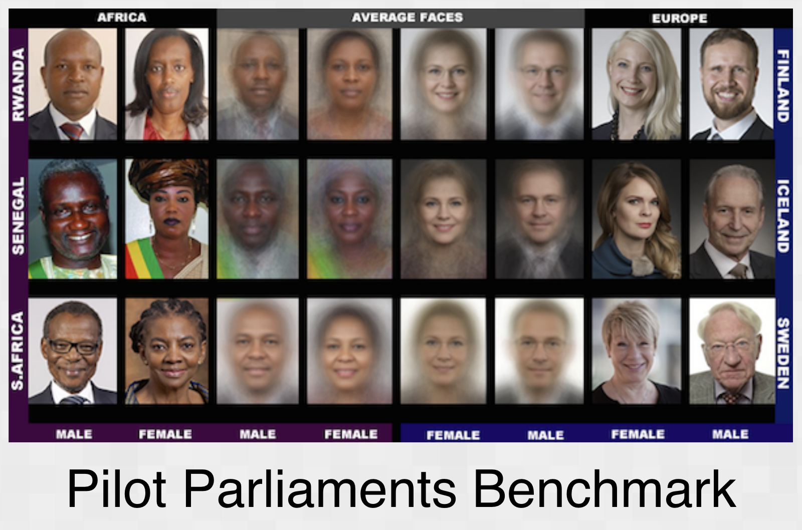
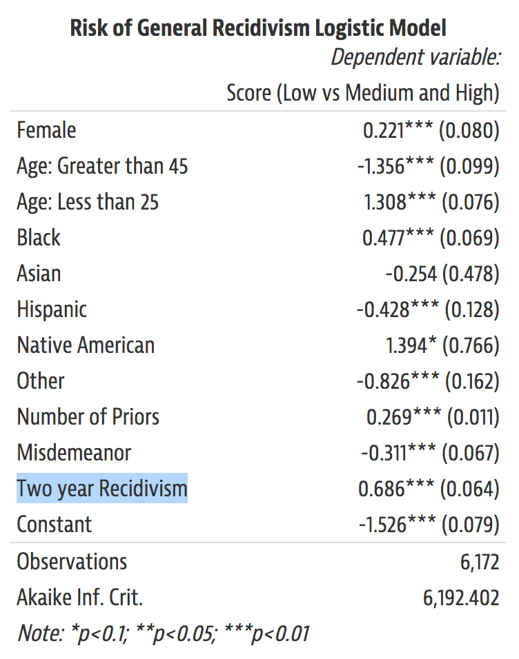
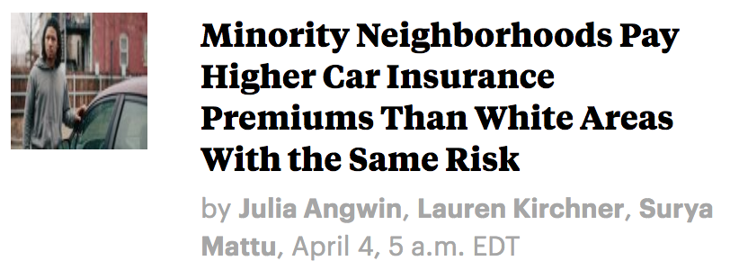
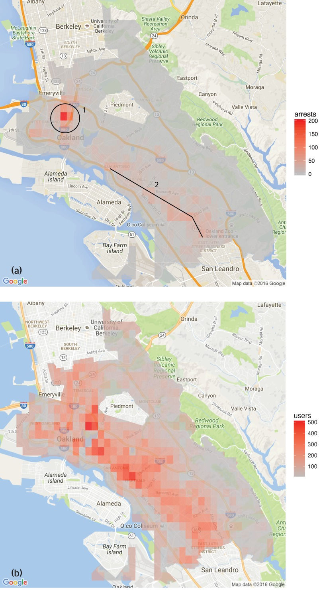
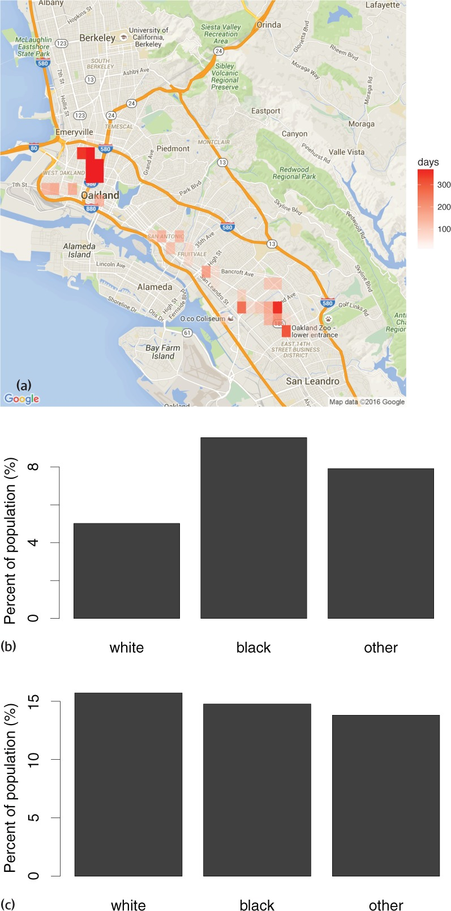

class: inverse

```{r setup, include=FALSE}
options(htmltools.dir.version = FALSE)
knitr::opts_chunk$set(fig.retina = 3, warning = FALSE, message = FALSE)
options(knitr.table.format = "html")
```

```{r xaringan-themer, include=FALSE, warning=FALSE}
library(xaringanthemer)
style_duo_accent(
  primary_color = "#2d708e",
  secondary_color = "#230433",
  link_color = "#55c667",
  text_bold_color = '#f68f46',
  title_slide_text_color = "#111111",
  title_slide_background_color = "#ffffff", #"#042333",
  title_slide_background_image = "https://cdn.vox-cdn.com/thumbor/eRYfQL3wM_LXvgAwR57_4qsE4uA=/0x0:4656x3104/1200x800/filters:focal(520x716:1264x1460)/cdn.vox-cdn.com/uploads/chorus_image/image/55292787/629851774.0.jpg",
  title_slide_background_size = "cover",
  ) #or contain
```

```{r xaringanextra, include=FALSE, warning=FALSE}
library(xaringanExtra)
#xaringanExtra::use_animate_all("slide_left")
xaringanExtra::use_tile_view()
xaringanExtra::use_panelset()
xaringanExtra::style_panelset_tabs(font_family = "inherit")
```

```{r tidyverse, include=FALSE, warning=FALSE}
library(tidyverse)
library(knitr)
theme_set(theme_minimal(base_size = 22))
set.seed(1)
library(broom)
library(modelr)
```

<style type="text/css">
.remark-slide-content {
    font-size: 1.2rem;
    padding: 1em 4em 1em 4em;
}
</style>

## Outline

#### Demystifying AI

What is it? What's *really* new about it?

#### Biases and racist algorithms

Examples in healthcare, policing, commerce

Fairness, biased data/models/systems, responsibility

#### Actions

Tech "solutions," inclusion, democratization, power

---
class: inverse

# What is AI?


.center[
(this might be the most controversial part of the talk)

## AI $\approx$ machine learning $\approx$ **regression**

]

- Function fit using an algorithm on data

- Maybe too complex for complete human understanding

- Performance evaluated by output on new / "fresh" data

(some special cases don't fit this exactly)

---

## ML / AI are "data hungry"

Predictions from lots of similar observations/examples. From [Stanford](http://cs231n.stanford.edu/):


---


"Examples" don't have to be images, this generalizes to anything that can be measured and transformed into data

---

## Historical

### Early computer era (~50 years ago)

Regression (prediction recipe) -- decision trees -- low dimensional smoothing

### Internet era (~20 years ago)

Machine learning -- "black box" (more complex) algorithms

### Big data, 3rd wave of AI (~10 years ago)

Network architecture (depth) -- datafication of images, etc


---

## What's new/different about AI?

.pull-left[

[Modern Times (1936)](https://en.wikipedia.org/wiki/Modern_Times_(film%29)
]
.pull-right[

[Amazon "fulfillment" center](https://revealnews.org/article/how-amazon-hid-its-safety-crisis/)
]

---

## First, what's the same?

.pull-left[
AI is continuous with, and inherits from:

- Technology

(especially IT)

- Social/economic systems

- [History](https://data-ppf.github.io/)
]
.pull-right[

]

It comes with politics, unequal costs and benefits

---

### Learn from history!

[David Gresham's talk](https://as.nyu.edu/cns/events/EventDescriptions/WorkshopRace/SessionOne.html) covered a lot of history already, but a few points specific to statistics / data / IT:

- Some founders of statistics were [eugenicists](https://nautil.us/issue/92/frontiers/how-eugenics-shaped-statistics)

- US Census Bureau [assisted with internment](https://exhibits.lib.berkeley.edu/spotlight/census/feature/japanese-americans-in-world-war-ii-and-the-census) of Japanese Americans during WW2

- [Before 1974](https://en.wikipedia.org/wiki/Equal_Credit_Opportunity_Act), [credit scores](https://www.forbes.com/advisor/credit-cards/from-inherent-racial-bias-to-incorrect-data-the-problems-with-current-credit-scoring-models/) could be explicitly racist

---

### Academics to the rescue! 

[FATML](https://www.fatml.org) workshop, 2014-2018, [FAccT conference](https://facctconference.org/) 2018-

.pull-left[

[2016](https://en.wikipedia.org/wiki/Weapons_of_Math_Destruction)
]
.pull-right[
Examples: admissions, credit, employment, insurance, healthcare

New dangers: scale, opacity, proxies/wrong data, faux objectivity
]

---

### Dangers of opacity, for example

[Reuters](https://www.reuters.com/article/us-amazon-com-jobs-automation-insight-idUSKCN1MK08G), in 2018:


> Amazon’s system **taught itself** that male candidates were preferable. It penalized resumes that included the word “women’s,” as in “women’s chess club captain.” And it downgraded graduates of two all-women’s colleges, according to people familiar with the matter.


---

Naive "progress" or "solutionist" views are (still) very widespread...


> What do you do if decisions that used to be made by humans, with all their biases, start being made by algorithms that are *mathematically incapable of bias*? If you’re rational, you should celebrate.

---
class: center, middle

(I'm not sure it's worth [taking this argument seriously](https://statmodeling.stat.columbia.edu/2020/12/29/retired-computer-science-professor-argues-that-decisions-are-being-made-by-algorithms-that-are-mathematically-incapable-of-bias-what-does-this-mean/), so only read this if the previous slide sounds reasonable


We might ask: was AI really not already political? Is there any way to interpret the statement that algorithms are "mathematically incapable of bias" to make it meaningfully true regarding the examples that people are trying to "debias"?)


---


### Classic methods (context/comparison)

#### Decision trees (e.g. vaccine eligibility in the UK)

- If `Age >= 40` then `yes`, otherwise `continue`
- If `HighRisk == TRUE` then `yes`, otherwise `continue`
- If `Job == CareWorker` then `yes`, otherwise `no`

#### Regression

- Predictor variables in the dataset: $x_1, x_2, \ldots, x_p$
- Coefficients/**parameters**, unknown: $\beta_1, \beta_2, \ldots, \beta_p$
- Outcome variable, also in data: $y$
- Algorithm inputs the data, outputs: estimated parameters, predictions of $y$ using "recipe" or "weighted" combination

$$
\beta_1 x_1 + \beta_2 x_2 + \cdots + \beta_p x_p
$$


---

### Present day methods

.pull-left[

]
.pull-right[
From [Computer Age Statistical Inference](https://web.stanford.edu/~hastie/CASI/):

]

Non-linear, deep (multiple) composition of functions


---

## Consistent trends

- **Larger datasets, faster computation, more parameters**

1801: [Gauss's](https://sites.math.rutgers.edu/~cherlin/History/Papers1999/weiss.html) first use of regression, ~5 parameters

2000s: models with ~thousands of parameters (e.g. [lasso](https://pubmed.ncbi.nlm.nih.gov/?term=lasso+regression))

2012: image model [AlexNet](https://en.wikipedia.org/wiki/AlexNet) uses ~61 million parameters

2020: language model [GPT-3](https://en.wikipedia.org/wiki/GPT-3) uses ~175 billion parameters


- Focus on improving prediction accuracy, sacrifice explainability to (non-expert) human audiences

- More categories of things analyzed as data

- More kinds of tasks "automated" (possibly: outsourced)

---

### Programming (and engineering reliability)

Code: human readable $\to$ machine executable $\to$ output

#### Deterministic programming

.pull-left[
```{r}
print("hello world")
```

]
.pull-right[
```{r}
round(1 / (0:3), 3)
```
]

Programmers know what to expect (but see: debugging)

#### Stochastic programming

Algorithms use random number generators

Inputs may include data

---

### Models, understanding and auditing

#### Classic

Human readable models like trees, regression

#### ML / AI

How to "read" a model with millions of parameters?

Is it fair? Legal?

We can check the **output** for [disparate impact](https://en.wikipedia.org/wiki/Disparate_impact)

More difficult to understand how the model [treats](https://en.wikipedia.org/wiki/Disparate_treatment) people

---

### Auditing opaque models: accuracy

From the [Gender shades](http://gendershades.org/) project (Buolamwini and Gebru)


---
class: center, middle


---
class: inverse, center, middle

# Biases and racist algorithms

---


# More motivating examples

- Health: Obermeyer et al
- Policing: Lum and Isaacs, ProPublica
- Consumption: Amazon
- Labor: Ghost work

With attention to these issues:

- Sampling bias, feedback
- Optimizing for the wrong thing
- Opacity, dimensionality, structural racism, causation
- Responsibility 


---

### AI and healthcare patient data

.pull-left[


]
.pull-right[

[Obermeyer et al (2019)](https://science.sciencemag.org/content/366/6464/447.editor-summary)

- Algorithm assigns risk scores by **predicting healthcare costs** from patient records
- Underestimates risk of health conditions for black patients compared to white patients
- **Adjusting algorithm** to close the gap results in ~2.5x black patients receiving more care

]

---

### Race and genomics in healthcare

We've heard about biased samples in health research

Different risk: a similar problem underlying [racist applications](https://www.nature.com/articles/d41586-018-06784-5) of behavioral genomics

.pull-left[
```{r echo = FALSE}
library(DiagrammeR)
mermaid("
graph LR
  R-->Y
  S-->Y
  R-->G
")
```
]
.pull-right[
Race $R$, structural racism $S$, health outcome $Y$, polygenic score $G$

Higher dimensional $G$ + more complex models = predicting $Y$ without knowing why
]


---

### Healthcare recap

- **Optimizing for the wrong thing**: price signals aggregate a lot of social information, possibly including lack of access, poverty, etc. Also an **opacity** issue because we generally don't know all these influences on observed demand/spending

- **Sampling bias**: differential access to healthcare

- **Dimensionality and causation**: we have far more (high-dimensional) genomic data now than socio-economic/environment data

---

### Policing: pre-trial detention risk scores

.pull-left[

]
.pull-right[





]

---

The [hope](https://www.kqed.org/education/507247/can-algorithms-help-wind-down-mass-incarceration): could more accurate risk assessments reduce incarceration, and maybe even reduce racial bias?

The reality: **proprietary**, opaque algorithms


- Multibillion-dollar bail industry spent $10 million opposing

- Did voters understand what these algorithms would do?

---

"Algorithm does not *explicitly* use race" -- in an unfair system **other things can correlate with race**, e.g. prior convictions

.pull-left[
```{r echo = FALSE}
mermaid("
graph LR
  R-->M
  S-->M
  S-->P
  M-->P
  P-->C
")
```
]
.pull-right[
Race $R$, structural racism $S$, arrested for marijuana $M$, prior conviction $P$, COMPAS risk score $C$

If $C$ is computed using only $P$, is that "fair"?

Next slide from [Lum and Isaac (2016)](https://rss.onlinelibrary.wiley.com/doi/full/10.1111/j.1740-9713.2016.00960.x)
]


---

.pull-left[

]

.pull-right[

]

---

## Predictive policing recap

- **Sampling bias, feedback**: training data from an unfair world, predictions leading to continued unfairness

- **Optimizing for the wrong thing**: algorithms learn from previous *arrests*, there is no (unbiased) data on all criminal activity

- **Structural racism and causation**: even if the algorithm does not explicitly use race, it uses variables that may be correlated with race *because* of a history of structural racism

---

### Commerce: Amazon same-day delivery


- **Responsibility**: who should remedy this disparity?

---

### AI in the economy

[Ghost work](https://www.theverge.com/2019/5/13/18563284/mary-gray-ghost-work-microwork-labor-silicon-valley-automation-employment-interview), [dark kitchens](https://www.ft.com/content/a66619b0-77e4-11e9-be7d-6d846537acab), [faster delivery](https://chuangcn.org/2020/11/delivery-renwu-translation/)


- **Responsibility**: who's taking the risks, who's getting rich?

---

### AI, globalization, and labor

[FT](https://www.ft.com/content/c6909812-9ce4-11e9-9c06-a4640c9feebb): Congo, child labour and your electric car

[Guardian](https://www.theguardian.com/global-development/2019/dec/16/apple-and-google-named-in-us-lawsuit-over-congolese-child-cobalt-mining-deaths): Apple and Google named in US lawsuit over Congolese child cobalt mining deaths

[Anatomy of AI](https://anatomyof.ai/): 
> Amnesty has documented children as young as 7 working in the mines. In contrast, Amazon CEO Jeff Bezos, at the top of our fractal pyramid, made an average of $275 million a day during the first five months of 2018, according to the Bloomberg Billionaires Index. A child working in a mine in the Congo would need **more than 700,000 years of non-stop work to earn the same amount as a single day of Bezos’ income**.


---
class: inverse

# Changing the world

There are real opportunities to make *fast/cheap* progress by changing algorithms

But we should not neglect more important actions

- Inclusion
- Regulations
- Democratizing data
- Educating and organizing

---

### Inclusion

[Black in AI](https://blackinai.github.io/#/about) founded in 2017


Obstacles: opposition, e.g. Google [firing AI ethics researchers](https://www.theverge.com/2021/2/19/22292011/google-second-ethical-ai-researcher-fired), toxic community/[workplaces](https://www.theguardian.com/technology/2019/nov/13/facebook-discrimination-black-workers-letter)


---

### Regulation

Members of the (US) [public](https://www.pewresearch.org/fact-tank/2020/10/27/how-americans-see-u-s-tech-companies-as-government-scrutiny-increases/) and [tech workers](https://www.cnet.com/news/even-silicon-valley-workers-want-more-regulation-of-the-tech-industry/) want more regulation. Obstacles: political/legal arms races, capture


---

### Democratizing data and AI


[Salomé Viljoen](https://phenomenalworld.org/analysis/data-as-property):

> Several proto-democratic data governance projects show us how the democratic governance over information flows may be realized. [...] Labor activists are developing worker data collectives to counter growing workplace surveillance by employers, track and monitor forms of workplace oppression, and document OSHA violations and wage theft. Finally, old models of public data collection and management like that of the US Census and its statistical agencies, which adhere to strong purpose limitations and confidentiality rules, may be expanded into more general bodies for the governance of data. 

---

### Conclusion: educating and organizing

.pull-left[

[George Box](https://en.wikipedia.org/wiki/George_E._P._Box)
]

.pull-right[

> [All models are wrong](All_models_are_wrong) but some are useful

therefore,

> ... the scientist must be alert to what is **importantly wrong**

> ... **cannot obtain a "correct" one** by excessive elaboration

]

---

What's **important** and what's **useful**?

- to who?
- for what?

How can we [change the objective function](https://en.wikipedia.org/wiki/Twelve_leverage_points) before it's [too late](https://en.wikipedia.org/wiki/Instrumental_convergence#Paperclip_maximizer)?
