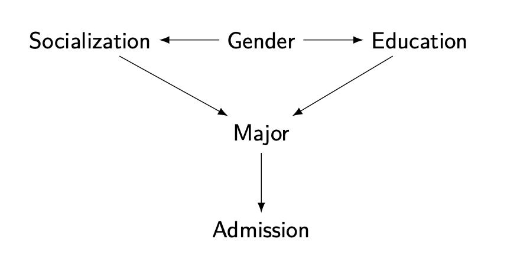
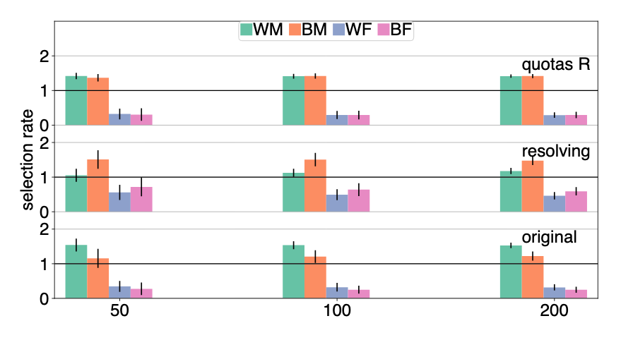
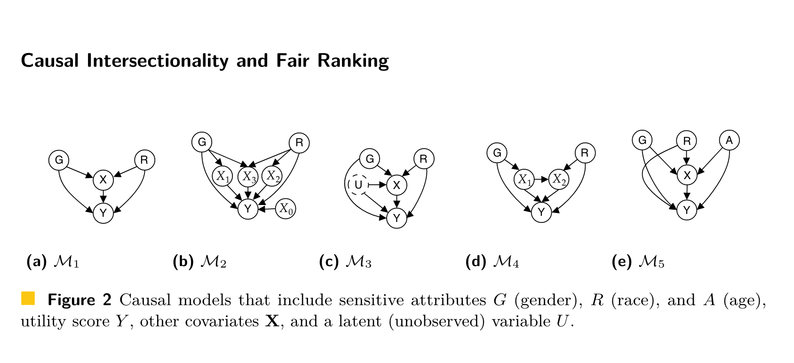

```{r setup, include=FALSE}
options(htmltools.dir.version = FALSE)
knitr::opts_chunk$set(fig.retina = 3, warning = FALSE, message = FALSE)
options(knitr.table.format = "html")
```

```{r xaringan-themer, include=FALSE, warning=FALSE}
library(xaringanthemer)
style_duo_accent(
  primary_color = "#2d708e",
  secondary_color = "#230433",
  link_color = "#55c667",
  text_bold_color = '#f68f46',
#  title_slide_text_color = "#444444",
  title_slide_background_color = "#ffffff", #"#042333",
  title_slide_background_image = "../../../files/theme/LSE/LSEcrest_large.jpg",
  title_slide_background_size = "cover",
  ) #or contain
```

```{r xaringanextra, include=FALSE, warning=FALSE}
#library(xaringanExtra)
#xaringanExtra::use_animate_all("slide_left")
#xaringanExtra::use_tile_view()
#xaringanExtra::use_panelset()
#xaringanExtra::style_panelset_tabs(font_family = "inherit")
```

```{r tidyverse, include=FALSE, warning=FALSE}
library(tidyverse)
library(knitr)
theme_set(theme_minimal(base_size = 22))
set.seed(1)
library(broom)
library(modelr)
```

<style type="text/css">
.remark-slide-content {
    font-size: 1.2rem;
    padding: 1em 4em 1em 4em;
}
</style>

### High level intro

Why focus on causality? (in socially/ethically important applications)

### Causal fairness

In prediction and ranking tasks, and with **intersectionality**

### Designing interventions

Optimal fair policies, causal **interference**

### Concluding thoughts

---

Two cultures again: prediction vs [action](https://twitter.com/whitesphd/status/1308094245669081089)


---

<iframe src="https://en.wikipedia.org/wiki/Simpson%27s_paradox#UC_Berkeley_gender_bias" scrolling= "no" height="600" width="760" ></iframe>

---

### Berkeley graduate admissions example

> The bias in the aggregated data stems **not from any pattern of discrimination on the part of admissions committees**, which seem quite fair on the whole, but apparently from **prior screening at earlier levels** of the educational system. Women are shunted by their **socialization and education** toward fields of graduate study that are generally more crowded, less productive of completed degrees, and less well funded, and that frequently offer poorer professional employment prospects.

From the final paragraph of Bickel et al (1975)

#### What information / covariates should we condition on?

---

### Directed Acyclic Graph (DAG) models



- Assumption: paths show conditional dependence
- Assumption: intervention to change one variable also affects all variables on paths away from it

---

## Two interpretations

### Interventions

**Can we change the DAG**, for example via socialization or education (emphasizing more women role models in STEM curricula, say?)

### Counterfactual fairness

I was admitted to grad school. **If I had been different**, had a different gender for example, maybe I would have had different socialization, applied to a different department, and not been admitted. **Is that fair**?

---

### (Infamous?) policing example

"Algorithm does not *explicitly* use race" -- in an unfair system **other things can correlate with race**, e.g. prior convictions

.pull-left[
```{r echo = FALSE}
library(DiagrammeR)
mermaid("
graph LR
  R-->M
  S-->M
  S-->P
  M-->P
  P-->C
")
```
]
.pull-right[
Race $R$, structural racism $S$, arrested for marijuana $M$, prior conviction $P$, risk score $C$

If $C$ is computed using only $P$, is that "fair"?

Next slide from [Lum and Isaac (2016)](https://rss.onlinelibrary.wiley.com/doi/full/10.1111/j.1740-9713.2016.00960.x)
]


---

.pull-left[

]

.pull-right[

]

---

## How do we get a DAG?

Simple examples are easy to understand

Too simple? Don't correspond to the real world?

### How do we know if it's "true"?

My opinion: we could use a healthy dose of (philosophical)

> [Pragmatism](https://en.wikipedia.org/wiki/Pragmatism) is a philosophical tradition that considers words and thought as *tools and instruments for prediction, problem solving, and action*, and rejects the idea that the function of thought is to describe, represent, or mirror reality.

---

### Statistical wisdom: models as (thinking) tools

.pull-left[

[George Box](https://en.wikipedia.org/wiki/George_E._P._Box)
]

.pull-right[

> [All models are wrong](All_models_are_wrong) but some are useful

therefore,

> ... the scientist must be alert to what is **importantly wrong**

> ... **cannot obtain a "correct" one** by excessive elaboration

]


---
class: split-four

### Every DAG is (importantly?) wrong

.column[
&nbsp; 

```{r echo = FALSE}
library(DiagrammeR)
mermaid("
graph TB
  Race-->Outcome
")
```
]
.column[
&nbsp; 

```{r echo = FALSE}
library(DiagrammeR)
mermaid("
graph TB
  Racism-->Outcome
")
```
]

.column[
&nbsp; 


```{r echo = FALSE}
library(DiagrammeR)
mermaid("
graph TB
  A-->X
  X-->Y
  A-->Y
")
```
]
.column[
&nbsp; 

```{r echo = FALSE}
library(DiagrammeR)
mermaid("
graph TB
  A-->X
  A-->R
  X-->Y
  R-->Y
  A-->Y
")
```
]


Transparency: we can say specifically what we disagree on (sometimes denote sensitive attribute $A$)

&nbsp;

&nbsp;

&nbsp;

&nbsp;

&nbsp;

[Kusner et al (2017)](https://papers.nips.cc/paper/2017/hash/a486cd07e4ac3d270571622f4f316ec5-Abstract.html),
[Kilbertus et al (2017)](https://papers.nips.cc/paper/2017/hash/f5f8590cd58a54e94377e6ae2eded4d9-Abstract.html),
[Nabi and Shpitser (2018)](https://ojs.aaai.org/index.php/AAAI/article/view/11553),
[Zhang and Bareinboim (2018)](https://aaai.org/ocs/index.php/AAAI/AAAI18/paper/view/16949/0),
[Chiappa (2019)](https://ojs.aaai.org//index.php/AAAI/article/view/4777), and a growing list of others

---

[Imbens (2019)](https://siepr.stanford.edu/sites/default/files/publications/19-022.pdf) on DAGs, reviewing The Book of Why:

>  TBOW and the DAG approach fully deserve the attention of all researchers and users of causal inference as one of its leading methodologies.

DAGs conveniently express some things but not others

> In economics the endogeneity often arises from agents actively making choices regarding the causal variable on the basis of anticipated effects of those choices

DAGs and Potential Outcomes are both useful

> identification results are also easier to derive in the PO framework

---

## Defining fairness causally

Kusner, Loftus, Russell, Silva. *Counterfactual fairness* ([NeurIPS 2017](https://papers.nips.cc/paper/2017/hash/a486cd07e4ac3d270571622f4f316ec5-Abstract.html)):

Given a DAG, the predictor $\hat Y$ is **counterfactually fair** if

$$P(\hat Y_a | x, a) = P(\hat Y_{a'} |x, a)$$


#### Proposition (sufficient, not necessary)
Any predictor $\hat Y$ which is a function of only non-descendents of $A$ in the DAG is counterfactually fair

#### Causal pathways

Fairness: block certain DAG paths in prediction (which?)

---

## [Intersectional](https://en.wikipedia.org/wiki/Intersectionality) fairness

Yang, Stoyanovich, Loftus. *Causal Intersectionality and Fair Ranking* ([FORC 2021](https://drops.dagstuhl.de/opus/portals/lipics/index.php?semnr=16187))

- Multiple sensitive attributes, e.g. race and gender

- Variety of relationships with other mediating variables

- Some of these mediators may be resolving/non-resolving for different sensitive attributes

Lots of scholarship, not much using formal mathematical models. See [Bright et al (2016)](https://www.journals.uchicago.edu/doi/abs/10.1086/684173), 
[O'Connor et al (2019)](https://www.tandfonline.com/doi/abs/10.1080/02691728.2018.1555870), and a few other references in our paper


---

## "Moving company" example

.pull-left[
Race, gender, weightlifting test, application score
```{r echo = FALSE, fig.align='right'}
library(DiagrammeR)
mermaid("
graph TB
  R-->X
  G-->X
  R-->Y
  X-->Y
  G-->Y
")
```
]
.pull-right[
Weightlifting considered a **resolving variable** (company argues it is a necessary qualification)

```{r, echo=FALSE, out.width="100%", fig.align='center'}

```

(See paper for results)
]


---

### Untangling intersectional relationships

Causal mediation with **multiple mediators** and **multiple causes** is a hard problem, limiting realistic application until better methods/data are available

#### Opportunity for statistical research



---

## Interventions under [interference](https://en.wikipedia.org/wiki/Spillover_(experiment%29)

Kusner, Russell, Loftus, Silva. Making Decisions that Reduce Discriminatory Impacts ([ICML 2019](http://proceedings.mlr.press/v97/kusner19a.html))

- Designing an optimal policy / intervention / allocation 

- Relaxing common assumption that intervention on individual/unit $i$ does not effect other individuals/units

(in fairness/justice applications that will often be **importantly wrong**)

- Constraint: bound **counterfactual privilege**, preventing "rich get richer" effect


---

### Optimal fair policies under interference

.pull-left[
Intervention $\mathbf Z$ trying to increase $\mathbf Y$

Privilege constraint, for $\tau \geq 0$
$$
\mathbb{E}[\mathbf{\hat Y}({\color{red}a},\mathbf{Z})] - \mathbb{E}[\mathbf{\hat Y}({\color{blue}a'},\mathbf{Z})] \leq \tau
$$
]
.pull-right[

]

Optimization problem (with budget constraint $b$)

$$\mathbf{Z} = \arg \max \sum_i \mathbb{E}\left[\mathbf{\hat Y}^{(i)}(a^{(i)}, \mathbf Z) | \mathbf A^{(i)}, \mathbf X^{(i)}  \right]$$

$$\quad s.t. \quad \sum_i \mathbf{Z}^{(i)} \leq b$$
---

### Allocating resources to (NYC) schools

.pull-left[
Without constraint

]
.pull-right[
With constraint

]

(See paper for discussion of results)

---

# "Bet" on causality

Claim: **causality** points us in good directions for research

- Choosing which covariates to condition on in fair prediction/decisions

- Changing focus from prediction to action, interventions, policy design, etc

- Making models/assumptions transparent

---

## New / future work

- Another recent paper ([blog post](https://nyudatascience.medium.com/the-impact-remediation-framework-discovering-optimal-intervention-policies-to-improve-equity-dfeea9d03cef) and [10min video](https://youtu.be/dnadhGEDIBQ?t=5340)) optimizing an intervention to reduce inequality, avoiding some causal modeling assumptions about social categories as causes

- More specific models/methods (e.g. multiple causes and mediators, various interference structures)

- Counterfactual "depth" (e.g. changing names to alter perception of gender/race) and responsibility

---
class: split-four

.column[

Matt Kusner (UCL)
&nbsp; 

&nbsp; 


Julia Stoyanovich
]

.column[

Chris Russell (AWS/ELLIS)

&nbsp; 


Ke Yang
]

.column[


Ricardo Silva (UCL)

&nbsp;  


Lucius Bynum
]

.column[
## Turing group

&nbsp; 

&nbsp; 

&nbsp; 

### NYU

Margarita Boyarskaya

]

---


### Thank you for listening!

Reading for a fairly general audience: The long road to fairer algorithms ([Nature, 2020](https://www.nature.com/articles/d41586-020-00274-3))

[joshualoftus.com](joshualoftus.com) where these slides are available, with links

Another version of this talk: [video](https://youtu.be/0xju3pEbPFE)


Remember pragmatism, Box's rule, and what's **important** and what's **useful**?

- to who?
- for what?

How can we [change the objective function](https://en.wikipedia.org/wiki/Twelve_leverage_points) before it's [too late](https://en.wikipedia.org/wiki/Instrumental_convergence#Paperclip_maximizer)?