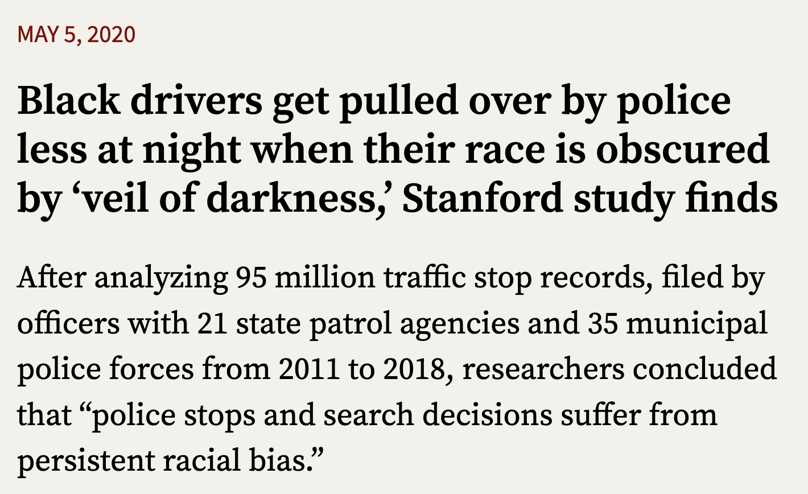

class: split-four

```{r setup, include=FALSE}
options(htmltools.dir.version = FALSE)
knitr::opts_chunk$set(fig.retina = 3, warning = FALSE, message = FALSE)
options(knitr.table.format = "html")
```

```{r xaringan-themer, include=FALSE, warning=FALSE}
library(xaringanthemer)
style_duo_accent(
  primary_color = "#2d708e",
  secondary_color = "#230433",
  link_color = "#55c667",
  text_bold_color = '#f68f46',
#  title_slide_text_color = "#444444",
  title_slide_background_color = "#ffffff", #"#042333",
  title_slide_background_image = "../../../files/theme/LSE/LSEcrest_large.jpg",
  title_slide_background_size = "cover",
  ) #or contain
```

```{r xaringanextra, include=FALSE, warning=FALSE}
#library(xaringanExtra)
#xaringanExtra::use_animate_all("slide_left")
#xaringanExtra::use_tile_view()
#xaringanExtra::use_panelset()
#xaringanExtra::style_panelset_tabs(font_family = "inherit")
```

```{r tidyverse, include=FALSE, warning=FALSE}
library(tidyverse)
library(knitr)
theme_set(theme_minimal(base_size = 22))
set.seed(1)
library(broom)
library(modelr)
library(reshape2)
```

<style type="text/css">
.remark-slide-content {
    font-size: 1.2rem;
    padding: 1em 4em 1em 4em;
}
</style>


### Credit to my excellent collaborators

#### Alan Turing Institute (2016-)

```{r echo = FALSE, fig.show='hold'}
knitr::include_graphics(c("ricardo.png", "matt.jpg",  "chris.png"))
```

Ricardo Silva, Matt Kusner (UCL) &nbsp; Chris Russell (AWS)

---

#### NYU (2020-) Julia Stoyanovich, Ke Yang, Lucius Bynum

```{r echo = FALSE, fig.show='hold', out.width="25%"}
knitr::include_graphics(c("julia.png", "ke.jpg", "lucius.png"))
```


#### LSE (2022-) Sakina Hansen

```{r echo = FALSE, fig.show='hold', out.width="30%"}
knitr::include_graphics(c("sakina.jpg"))
```

---
class: inverse, center, middle

# Motivating example

---

### The red car example

Consider a car insurance company that wants to predict the risk of insuring potential customers using data on

- Gender $A$
- Car color $X$
- Driving records $Y$

ML task: learn a function $f(X,A)$ to predict $Y$

Why? Use the learned function $f$ to predict the risk of the policy for a new customer.

**Q**: Is it fair to fit a function $f(X) \approx Y$?

**A**: It depends on the *underlying causal structure of the world*

---

Let's generate some data in an idealized world:

```{r}
A <- rbinom(1000, 1, .5)
U <- rnorm(1000)
X <- A + U > 1
Y <- U > 1/2
world <- data.frame(Gender = factor(c("Other", "Woman")[as.numeric(A)+1]),
                    CarColor = factor(c("Silver", "Red")[as.numeric(X)+1]),
                    Aggressiveness = U,
                    HighRisk = Y)
head(world)
```


---

We can visualize causal relationships between variables in a **directed acyclic graph** (DAG). A directed arrow indicates its starting point is a cause of its ending point. Every variable is a function of all its (directed) parents (and exogenous noise, if the model is probabilistic)

```{r echo=FALSE}
mermaid(
  "graph TB;
  A[Gender]-->X[Car Color]
  U(Aggression)-->X
  U-->Y[Risk]"
)
```

---

There's no relationship between gender and aggressiveness in this data (same for risk)

```{r echo=FALSE}
ggplot(world, aes(Gender, Aggressiveness)) + geom_boxplot() + theme_minimal()
```

---

If the company bases its decisions on $X$ only, and not $A$, it will charge higher costs to people with red cars:

```{r echo=FALSE}
ggplot(world, aes(CarColor, Aggressiveness)) + geom_boxplot() + theme_minimal()
```

---

There are more women with red cars than men (independently of aggression/risk).

```{r}
table(world$Gender, world$CarColor)
```

To summarize: we started with an ideal world where there is no actual unfairness on the basis of gender, but by *ignoring* gender in our predictions we can actually *create* unfairness

Enforcing SCOTUS's definition of fairness leads to unfair predictions because the underlying causal structure of the world was ignored by the model

---
class: inverse, center, middle

## What about the real world?

---

.small[
**Are Emily and Greg More Employable than Lakisha and Jamal?** (Bertrand and Mullainathan, 2003)

Systemic Discrimination Among Large U.S. Employers (Kline et al, 2022)

*Whitened Resumes: Race and Self-Presentation in the Labor Market* (Kang et al, 2016)
]

 [Source](https://hbswk.hbs.edu/item/minorities-who-whiten-job-resumes-get-more-interviews)

---

Randomize (or blind) the **perception** of a sensitive variable (e.g. race) at one (late?) time point



---
class: inverse, center, middle

# Causal fairness

---

## Defining fairness causally

#### Counterfactual fairness
Kusner, Loftus, Russell, Silva. ([NeurIPS 2017](https://papers.nips.cc/paper/2017/hash/a486cd07e4ac3d270571622f4f316ec5-Abstract.html)):

Given a DAG, the predictor $\hat Y$ is **counterfactually fair** if

$$\mathbb P(\hat Y_a | x, a) = \mathbb P(\hat Y_{a'} |x, a)$$


#### Proposition (sufficient, not necessary):
Any predictor $\hat Y$ which is a function of only non-descendents of $A$ in the DAG is counterfactually fair


---

### Pathway analysis / decomposition

.pull-left[


- [Kilbertus et al (2017)](https://papers.nips.cc/paper/2017/hash/f5f8590cd58a54e94377e6ae2eded4d9-Abstract.html): proxies and **resolving variables**

]


.pull-right[
- [Kusner et al (2017)](https://papers.nips.cc/paper/2017/hash/a486cd07e4ac3d270571622f4f316ec5-Abstract.html): path-dependent counterfactual fairness (see supplement)
- [Zhang et al (2017)](https://www.ijcai.org/proceedings/2017/549)
- [Nabi and Shpitser (2018)](https://ojs.aaai.org/index.php/AAAI/article/view/11553)
- [Zhang and Bareinboim (2018)](https://aaai.org/ocs/index.php/AAAI/AAAI18/paper/view/16949/0)
- [Chiappa (2019)](https://ojs.aaai.org//index.php/AAAI/article/view/4777)
- ...

]

---

## [Intersectional](https://en.wikipedia.org/wiki/Intersectionality) fairness

*Causal Intersectionality and Fair Ranking* (Yang, Stoyanovich, Loftus, [FORC 2021](https://drops.dagstuhl.de/opus/portals/lipics/index.php?semnr=16187))

- Multiple sensitive attributes, e.g. race and gender

- Variety of relationships with other mediating variables

- Some of these mediators may be resolving/non-resolving for different sensitive attributes

Lots of scholarship, not much using formal mathematical models. See [Bright et al (2016)](https://www.journals.uchicago.edu/doi/abs/10.1086/684173), 
[O'Connor et al (2019)](https://www.tandfonline.com/doi/abs/10.1080/02691728.2018.1555870), and a few other references in our paper


---

## "Moving company" example

.pull-left[
Race, gender, weightlifting test, application score
```{r echo = FALSE, fig.align='right'}
library(DiagrammeR)
mermaid("
graph TB
  R-->X
  G-->X
  R-->Y
  X-->Y
  G-->Y
")
```
]
.pull-right[
Weightlifting considered a **resolving variable** (company argues it is a necessary qualification)

```{r, echo=FALSE, out.width="100%", fig.align='center'}
knitr::include_graphics("../moving.png")
```

(See paper for results)
]


---

### Optimizing/allocating interventions

- [Making decisions that reduce discriminatory impacts](https://proceedings.mlr.press/v97/kusner19a.html) (Kusner et al, ICML 2019)

Optimizing interventions/allocations under causal interference, asymmetric bound on counterfactual privilege

- [Disaggregated interventions to reduce inequality](https://dl.acm.org/doi/abs/10.1145/3465416.3483286) (Bynum et al, EAAMO 2021)

Avoids using sensitive attributes as causes, optimizes for inequality reduction directly

- [Counterfactuals for the Future](https://ojs.aaai.org/index.php/AAAI/article/view/26655) (Bynum et al, AAAI 2023)

What can go wrong if we confuse interventional and counterfactual modeling?

---

### Statistical fairness $\leftrightarrow$ causal fairness?

**Exercise**: Pick one or more definitions of statistical fairness and determine a DAG/SCM with a related/corresponding definition of [path-specific] counterfactual fairness

e.g. what if $Y$ is a resolving variable?


---

class: center, middle, inverse

# Causal interpretability


---

### Classic methods (context/comparison)

#### Decision trees (e.g.: early vaccine eligibility)

- If `Age >= 40` then `yes`, otherwise `continue`
- If `HighRisk == TRUE` then `yes`, otherwise `continue`
- If `Job == CareWorker` then `yes`, otherwise `no`

#### Regression

- Predictor variables in the dataset: $x_1, x_2, \ldots, x_p$
- Coefficients/**parameters**, unknown: $\beta_1, \beta_2, \ldots, \beta_p$
- Outcome variable, also in data: $y$
- Algorithm inputs the data, outputs: estimated parameters, predictions of $y$ using "recipe" or "weighted" combination

$$
\beta_1 x_1 + \beta_2 x_2 + \cdots + \beta_p x_p
$$

---

## Transparent models

Understand how the model uses $x_1$ to make a prediction...

## Opaque or black-box models

Internal model structure is hidden, or complicated enough to be difficult to understand

### xAI / IML

Tools to help human understanding of models

Usually focused on input-output

---

## Model-agnostic interpretability

If we can only access the input-output interface (e.g. external auditing of a proprietary model)

Does this black-box model discriminate? How does it depend on `age`?

Various IML tools: variable importance, **partial dependence plots**, local surrogates, "counterfactual" explanations (misnamed)

**Problem**: In the question "how does the output depend on a given input?" *what do we mean* by "depend"?

e.g. fairness and (proxies for) sensitive attributes

---

## Causal interpretability

- *Causal Interpretations of Black-Box Models* (Zhao and Hastie, 2019)

Conditions under which a particular IML tool (PDP/ICE plots) can give valid causal conclusions

- *Causal Dependence Plots* (Loftus, Bynum, Hansen, 2023 [preprint](https://arxiv.org/abs/2303.04209))

---


---

class: inverse, center, middle

## Pathways forward

### Conclusions and takeaways


---

### At some point we must decide

#### Which (causal) model reveals our beliefs?

[George Box](https://en.wikipedia.org/wiki/George_E._P._Box):


> [All models are wrong](All_models_are_wrong) but some are useful

--

therefore,

> ... the scientist must be alert to what is **importantly wrong**

> ... **cannot obtain a "correct" one** by excessive elaboration

---
class: split-four

### Every DAG is (importantly?) wrong

.column[
&nbsp; 

```{r echo = FALSE}
library(DiagrammeR)
mermaid("
graph TB
  Race-->Outcome
")
```
]
.column[
&nbsp; 

```{r echo = FALSE}
library(DiagrammeR)
mermaid("
graph TB
  Racism-->Outcome
")
```
]

.column[
&nbsp; 


```{r echo = FALSE}
library(DiagrammeR)
mermaid("
graph TB
  A-->X
  X-->Y
  A-->Y
")
```
]
.column[
&nbsp; 

```{r echo = FALSE}
library(DiagrammeR)
mermaid("
graph TB
  A-->X
  A-->R
  X-->Y
  R-->Y
  A-->Y
")
```
]

&nbsp;

&nbsp;

&nbsp;

&nbsp;

&nbsp;

&nbsp;


**Transparency**: we can say specifically what we disagree on

**Interpretation**: meanings of variables, edges (mechanisms)


---

#### Problem

- Lots of fairness definitions (at least 21!)
- Impossibility/trade-offs between them
- What do?
- How to think about this choice?

--

#### Time heuristic
"Center" an oft-ignored dimension: **time**

(i.e. consider the times when variable values are determined)

---

#### Notation for fair classification

Desired outcome $Y = 1$, sensitive attribute $A$, predictor $M$ (mediator/merit), algorithm score/classification $D$

#### Causal graph: time flows left to right
.left-column[
Note: arrows from $A$ may be due to discrimination (e.g. $M$ could be an unfair measure of "merit")
]
.right-column[
<center>
```{r echo = FALSE}
library(DiagrammeR)
mermaid("
graph LR
  subgraph  
  A((A))-->M((M))
  M-->Y((Y))
  end
  Y-.->D
  A-->Y
  A-.->D
  M-.->D
")
```

</center>
]


---

#### Demographic parity 
Predictions (or decisions) are independent of $A$:
$$
\mathbb P(D = 1 | A = 0) = \mathbb P(D = 1 | A = 1)
$$


#### Equality of opportunity (Hardt et al, 2016)
Conditional parity, among individuals 'qualified' for the desirable outcome
$$
\mathbb P(D = 1 | A = 0, Y = 1) = \mathbb P(D = 1 | A = 1, Y = 1)
$$

#### Causal versions (e.g. counterfactual fairness)
Pathway analysis, *allowing* a causal pathway to change the prediction is like conditioning on a variable in that pathway

---

### Allowed variables

Definition: Variable $W$ determined at time $t$ is "allowed" by fairness definition $C$ if:
  - $C$ is a conditional fairness definition and $W$ is in the condition
  - $C$ is a causal pathway definition and $W$ is on an unblocked (i.e. resolving) pathway

---

### Temporal depth heuristic


#### Weak heuristic
If $W$, determined at time $t$, is allowed by $C$ then $C$ "justifies" any unfairness associated with (or causally flowing through) $W$ occurring before $t$

#### Strong heuristic (thick/dense causality)
If $W$, determined at time $t$, is allowed by $C$ then $C$ "justifies" all unfairness occurring before time $t$


---

### Applying the time heuristic

According to the strong heuristic, *equality of opportunity essentially allows all unfairness*

Demographic parity or (non-path-specific) counterfactual fairness do not justify any unfairness

(Future work tbd)

---

### Why allow any unfairness?

EU [Equality Directive](https://eur-lex.europa.eu/legal-content/EN/ALL/?uri=CELEX:32000L0043), CHAPTER I, Article 2 (b):

> indirect discrimination [...] would put persons of a racial or ethnic origin at a particular disadvantage compared with other persons, *unless that provision, criterion or practice is objectively **justified*** by a legitimate aim and the means of achieving that aim are appropriate and necessary.

US [civil rights](https://www.justice.gov/crt/fcs/T6Manual7#P) law: 

> If the evidence establishes a prima facie case of adverse disparate impact [...] courts then determine whether the recipient has articulated a "*substantial legitimate **justification***" [...]

---

### Maybe the law is bad?

Disclaimer: I am not a lawyer


---

### Exciting advances in causal modeling

Observational data, double machine learning, causal reinforcement learning, ...

### Applications in ethical data science

Prioritizing normative values: fairness, privacy, interpretability, replicability, "alignment," ...


---

### Bet on causality

Claim: **causality** points us in good directions for research

- Choosing which covariates to condition on in fair prediction/decisions
- Changing focus from prediction to action, interventions, policy design, etc
- Making models/assumptions transparent

Deirdre Mulligan at (NeurIPS 2022) causal fairness workshop:

> the important role [causal models] can play in supporting **collaborative reasoning about contested concepts, facilitating stakeholder participation** in decisions about how to meet policy goals within technical systems
