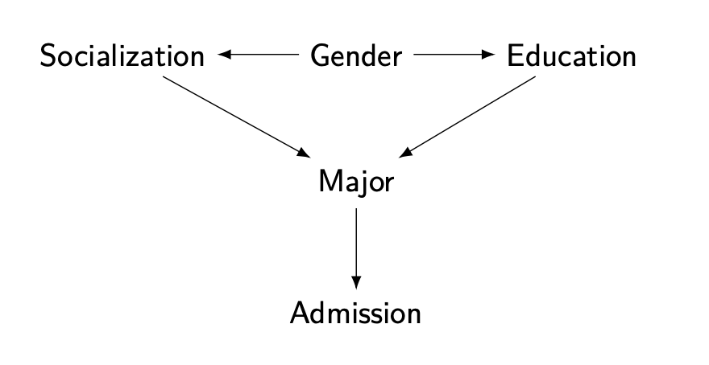

class: split-four

```{r setup, include=FALSE}
options(htmltools.dir.version = FALSE)
knitr::opts_chunk$set(fig.retina = 3, warning = FALSE, message = FALSE)
options(knitr.table.format = "html")
```

```{r xaringan-themer, include=FALSE, warning=FALSE}
library(xaringanthemer)
style_duo_accent(
  primary_color = "#2d708e",
  secondary_color = "#230433",
  link_color = "#55c667",
  text_bold_color = '#f68f46',
#  title_slide_text_color = "#444444",
  title_slide_background_color = "#ffffff", #"#042333",
  title_slide_background_image = "../../../files/theme/LSE/LSEcrest_large.jpg",
  title_slide_background_size = "cover",
  ) #or contain
```

```{r xaringanextra, include=FALSE, warning=FALSE}
library(xaringanExtra)
#xaringanExtra::use_animate_all("slide_left")
#xaringanExtra::use_tile_view()
#xaringanExtra::use_panelset()
#xaringanExtra::style_panelset_tabs(font_family = "inherit")
```

```{r tidyverse, include=FALSE, warning=FALSE}
library(tidyverse)
library(knitr)
theme_set(theme_minimal(base_size = 22))
set.seed(1)
library(broom)
library(modelr)
```

<style type="text/css">
.remark-slide-content {
    font-size: 1.2rem;
    padding: 1em 4em 1em 4em;
}
</style>

## Outline

- Unfair algorithms: examples and background

- Statistical fairness

- **(Structural) causal models**

- Counterfactual fairness

- Auditing (black-box) algorithms

- Causal interpretability

---

class: center, middle, inverse

# Causal models


---

class: center, middle, inverse

# Counterfactual fairness

---

### Back in 2016

I thought: seems like this is about **causality**?

The "effect" of one variable, possibly "controlling for" others

Holland: **no causation without manipulation**


What can we manipulate?


---

Randomize (or blind) the **perception** of a sensitive variable (e.g. race) at one (late?) time point


---

### Berkeley graduate admissions example

> The bias in the aggregated data stems **not from any pattern of discrimination on the part of admissions committees**, which seem quite fair on the whole, but apparently from **prior screening at earlier levels** of the educational system. Women are shunted by their **socialization and education** toward fields of graduate study that are generally more crowded, less productive of completed degrees, and less well funded, and that frequently offer poorer professional employment prospects.

From the final paragraph of Bickel et al (1975)

#### What information / covariates should we condition on?

---

### Directed Acyclic Graph (DAG) models



- Assumption: paths show conditional dependence
- Assumption: intervention to change one variable also affects all variables on paths away from it


---

### Race and genomics in healthcare

We've heard about biased samples in health research

Different risk: a similar problem underlying [racist applications](https://www.nature.com/articles/d41586-018-06784-5) of behavioral genomics

.pull-left[
```{r echo = FALSE}
library(DiagrammeR)
mermaid("
graph LR
  R-->Y
  S-->Y
  R-->G
")
```
]
.pull-right[
Race $R$, structural racism $S$, health outcome $Y$, polygenic score $G$

Higher dimensional $G$ + more complex models = predicting $Y$ without knowing why
]

---

### Healthcare recap

- **Optimizing for the wrong thing**: price signals aggregate a lot of social information, possibly including lack of access, poverty, etc. Also an **opacity** issue because we generally don't know all these influences on observed demand/spending

- **Sampling bias**: differential access to healthcare

- **Dimensionality and causation**: we have far more (high-dimensional) genomic data now than socio-economic/environment data


---

### (Infamous?) policing example

"Algorithm does not *explicitly* use race" -- in an unfair world, **other things can correlate with race**, e.g. prior convictions

.pull-left[
```{r echo = FALSE}
library(DiagrammeR)
mermaid("
graph LR
  R-->M
  S-->M
  S-->P
  M-->P
  P-->C
")
```
]

.pull-right[
Race $R$, structural racism $S$, arrested for marijuana $M$, prior conviction $P$, risk score $C$

If $C$ is computed using only $P$ (and not $R$ *directly*), is that "fair"?
]

---

### Fairness focused on one (later?) stage

- *perception* of race/gender
- balance *among applicants*

#### does not fix unfairness that occurred earlier

**Counterfactuals** help us think about this. **Depth** of the counterfactual story (starting earlier in time and/or length of causal pathway) corresponds to more/less fairness

VanderWeele and Robinson, 2015:

> ... we tried to [...] provide a causal interpretation of the race coefficient in regression models that would be palatable to someone who was opposed to discussing causal effects for non-manipulable variables.


---

## Defining fairness causally

Kusner, Loftus, Russell, Silva. *Counterfactual fairness* ([NeurIPS 2017](https://papers.nips.cc/paper/2017/hash/a486cd07e4ac3d270571622f4f316ec5-Abstract.html)):

Given a DAG, the predictor $\hat Y$ is **counterfactually fair** if

$$P(\hat Y_a | x, a) = P(\hat Y_{a'} |x, a)$$


#### Proposition (sufficient, not necessary):
Any predictor $\hat Y$ which is a function of only non-descendents of $A$ in the DAG is counterfactually fair


---

### Pathway analysis / decomposition

.pull-left[


- [Kilbertus et al (2017)](https://papers.nips.cc/paper/2017/hash/f5f8590cd58a54e94377e6ae2eded4d9-Abstract.html): proxies and **resolving variables**

]


.pull-right[
- [Kusner et al (2017)](https://papers.nips.cc/paper/2017/hash/a486cd07e4ac3d270571622f4f316ec5-Abstract.html): path-dependent counterfactual fairness (see supplement)
- [Zhang et al (2017)](https://www.ijcai.org/proceedings/2017/549)
- [Nabi and Shpitser (2018)](https://ojs.aaai.org/index.php/AAAI/article/view/11553)
- [Zhang and Bareinboim (2018)](https://aaai.org/ocs/index.php/AAAI/AAAI18/paper/view/16949/0)
- [Chiappa (2019)](https://ojs.aaai.org//index.php/AAAI/article/view/4777)
- ...

]


---
class: split-four

### Every DAG is (importantly?) wrong

.column[
&nbsp; 

```{r echo = FALSE}
library(DiagrammeR)
mermaid("
graph TB
  Race-->Outcome
")
```
]
.column[
&nbsp; 

```{r echo = FALSE}
library(DiagrammeR)
mermaid("
graph TB
  Racism-->Outcome
")
```
]

.column[
&nbsp; 


```{r echo = FALSE}
library(DiagrammeR)
mermaid("
graph TB
  A-->X
  X-->Y
  A-->Y
")
```
]
.column[
&nbsp; 

```{r echo = FALSE}
library(DiagrammeR)
mermaid("
graph TB
  A-->X
  A-->R
  X-->Y
  R-->Y
  A-->Y
")
```
]

&nbsp;

&nbsp;

&nbsp;

&nbsp;

&nbsp;

&nbsp;


**Transparency**: we can say specifically what we disagree on

**Interpretation**: meanings of variables, edges (mechanisms)


---

## [Intersectional](https://en.wikipedia.org/wiki/Intersectionality) fairness

*Causal Intersectionality and Fair Ranking* (Yang, Stoyanovich, Loftus, [FORC 2021](https://drops.dagstuhl.de/opus/portals/lipics/index.php?semnr=16187))

- Multiple sensitive attributes, e.g. race and gender

- Variety of relationships with other mediating variables

- Some of these mediators may be resolving/non-resolving for different sensitive attributes

Lots of scholarship, not much using formal mathematical models. See [Bright et al (2016)](https://www.journals.uchicago.edu/doi/abs/10.1086/684173), 
[O'Connor et al (2019)](https://www.tandfonline.com/doi/abs/10.1080/02691728.2018.1555870), and a few other references in our paper


---

## "Moving company" example

.pull-left[
Race, gender, weightlifting test, application score
```{r echo = FALSE, fig.align='right'}
library(DiagrammeR)
mermaid("
graph TB
  R-->X
  G-->X
  R-->Y
  X-->Y
  G-->Y
")
```
]
.pull-right[
Weightlifting considered a **resolving variable** (company argues it is a necessary qualification)

```{r, echo=FALSE, out.width="100%", fig.align='center'}
knitr::include_graphics("../moving.png")
```

(See paper for results)
]


---

### Untangling intersectional relationships

*Race as a Bundle of Sticks* (Sen and Wasow, 2016)

Causal mediation with **multiple mediators** and **multiple causes** is a hard problem, limiting realistic application until better methods/data are available


---

class: center, middle, inverse

# Auditing (black-box) algorithms


---

### Classic methods (context/comparison)

#### Decision trees (e.g.: early vaccine eligibility)

- If `Age >= 40` then `yes`, otherwise `continue`
- If `HighRisk == TRUE` then `yes`, otherwise `continue`
- If `Job == CareWorker` then `yes`, otherwise `no`

#### Regression

- Predictor variables in the dataset: $x_1, x_2, \ldots, x_p$
- Coefficients/**parameters**, unknown: $\beta_1, \beta_2, \ldots, \beta_p$
- Outcome variable, also in data: $y$
- Algorithm inputs the data, outputs: estimated parameters, predictions of $y$ using "recipe" or "weighted" combination

$$
\beta_1 x_1 + \beta_2 x_2 + \cdots + \beta_p x_p
$$

---

## Transparent models

Understand how the model uses $x_1$ to make a prediction...

## Opaque or black-box models

Internal model structure is hidden, or complicated enough to be difficult to understand

### xAI / IML

Tools to help human understanding of models

Usually focused on input-output

---

## Model-agnostic interpretability

If we can only access the input-output interface (e.g. external auditing of a proprietary model)

Does this black-box model discriminate? How does it depend on `age`?

Various IML tools: variable importance, partial dependence plots, local surrogates, "counterfactual" explanations (misnamed)

**Problem**: What do we mean by "depend" in "how does the output depend on a given input?"

e.g. *proxies* for sensitive attributes

---

class: center, middle, inverse

# Causal interpretability


---

## Causal interpretability

- *Causal Interpretations of Black-Box Models* (Zhao and Hastie, 2019)

Conditions under which a particular IML tool (PDP/ICE plots) can give valid causal conclusions

- *Causal Dependence Plots for Interpretable Machine Learning* (Loftus, Bynum, Hansen, 2023 [preprint](https://arxiv.org/abs/2303.04209))

---


---

class: center, middle

# Concluding

---

### Exciting advances in causal modeling

Observational data, double machine learning, causal reinforcement learning, ...

### Applications in ethical data science

Prioritizing normative values: fairness, privacy, interpretability, replicability, "alignment," ...


---

### Bet on causality

Claim: **causality** points us in good directions for research

- Choosing which covariates to condition on in fair prediction/decisions
- Changing focus from prediction to action, interventions, policy design, etc
- Making models/assumptions transparent

Deirdre Mulligan at (NeurIPS 2022) causal fairness workshop:

> the important role [causal models] can play in supporting **collaborative reasoning about contested concepts, facilitating stakeholder participation** in decisions about how to meet policy goals within technical systems

---

### What's new (or changing) with algorithms?

WMD book: **scale**, opacity(?)

Surveillance by governments: [Seeing Like a State (book)](https://en.wikipedia.org/wiki/Seeing_Like_a_State)

Surveillance by business: [Surveillance capitalism](https://en.wikipedia.org/wiki/Surveillance_capitalism)

[Predatory inclusion](https://journals.sagepub.com/doi/pdf/10.1177/2329496516686620) (e.g. wellness app sharing [patient data](https://techcrunch.com/2023/04/04/monument-tempest-alcohol-data-breach/))

[Data colonialism](https://purdue.edu/critical-data-studies/collaborative-glossary/data-colonialism.php)

---

### Philosophy of statistics/science

.pull-left[

Richard Feynman, 1974
]
.pull-right[
[Cargo cult science](https://en.wikipedia.org/wiki/Cargo_cult_science)/[statistics](https://www.significancemagazine.com/2-uncategorised/593-cargo-cult-statistics-and-scientific-crisis)

[Mindless statistical inference](https://citeseerx.ist.psu.edu/viewdoc/download?doi=10.1.1.821.8442&rep=rep1&type=pdf)

*Imitate success*


> computing machines, with a perfect lack of discrimination, will do any foolish thing they are told to do

> the simple-mindedness of mathematics–its willingness, like that of a computing machine, to elaborate upon any idea, however absurd; to dress scientific brilliancies and scientific absurdities alike in the impressive uniform of formulae and theorems

]

---

### Balancing views

[A. N. Whitehead](https://en.wikipedia.org/wiki/Alfred_North_Whitehead) in *An Introduction to Mathematics* (1911):

> It is a profoundly erroneous truism [...] that we should *cultivate the habit of thinking of what we are doing*. The precise opposite is the case. **Civilization advances by extending the number of important operations which we can perform without thinking** about them. Operations of thought are like cavalry charges in a battle — they are strictly limited in number, they require fresh horses, and must only be made at decisive moments. 

Key: what does it mean *civilization* advances? Who? How?

---

### Decreasing human judgment?

Flowchart version of statistics

Unintuitive for many statisticians

We often want "assumption lean" methods

---

### Wrap-up: ethical data science

Data and information technology are powerful tools

As with other human technologies (e.g. fossil fuel energy, nuclear technology) the **consequences** of data science will depend on **who uses it** and **for what purposes**

**Data scientists** do work that becomes part of our information infrastructure. Like **city planners**, our decisions can impact everyone

**Professionalism**: (e.g. medicine, engineering, law) often require ethical training, license to practice

---

### First, do no harm

Tradition in medicine, [Hippocratic oath]((https://en.wikipedia.org/wiki/Primum_non_nocere)

Blame for harm typically does not fall on machines or algorithms, but on the people who built or used them

(that could be you!)

**Avoiding harm is only the beginning** of ethics

(Credit for benefit of algorithms)

---

### 감사해요!

Reading for a fairly general audience: The long road to fairer algorithms ([Nature, 2020](https://www.nature.com/articles/d41586-020-00274-3))

[joshualoftus.com](joshualoftus.com) slides and other info


### Parting wisdom (hard won, not by me)

Remember Box's rule: what's **important**? what's **useful**? (to who?)
