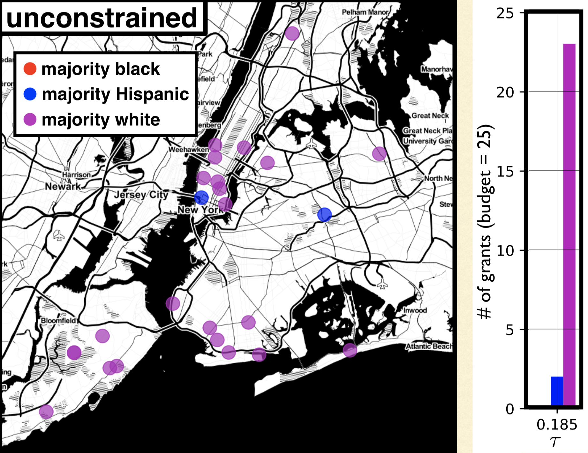
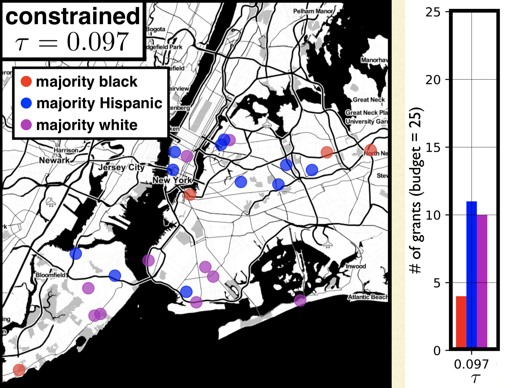

class: split-four

```{r setup, include=FALSE}
options(htmltools.dir.version = FALSE)
knitr::opts_chunk$set(fig.retina = 3, warning = FALSE, message = FALSE)
options(knitr.table.format = "html")
```

```{r xaringan-themer, include=FALSE, warning=FALSE}
library(xaringanthemer)
style_duo_accent(
  primary_color = "#2d708e",
  secondary_color = "#230433",
  link_color = "#55c667",
  text_bold_color = '#f68f46',
#  title_slide_text_color = "#444444",
  title_slide_background_color = "#ffffff", #"#042333",
  title_slide_background_image = "../../../files/theme/LSE/LSEcrest_large.jpg",
  title_slide_background_size = "cover",
  ) #or contain
```

```{r xaringanextra, include=FALSE, warning=FALSE}
library(xaringanExtra)
#xaringanExtra::use_animate_all("slide_left")
#xaringanExtra::use_tile_view()
#xaringanExtra::use_panelset()
#xaringanExtra::style_panelset_tabs(font_family = "inherit")
```

```{r tidyverse, include=FALSE, warning=FALSE}
library(tidyverse)
library(knitr)
theme_set(theme_minimal(base_size = 22))
set.seed(1)
library(broom)
library(modelr)
```

<style type="text/css">
.remark-slide-content {
    font-size: 1.2rem;
    padding: 1em 4em 1em 4em;
}
</style>

### Impossibility: competing DAGs / pathways

*When Worlds Collide: Integrating Different Counterfactual Assumptions in Fairness* (Russell et al, [NeurIPS 2017](https://papers.nips.cc/paper/2017/hash/1271a7029c9df08643b631b02cf9e116-Abstract.html))

- Approximate counterfactual fairness (relax equality constraint)
- Approximately satisfy fairness across both (all) models
- Limitation: the more contradictory are the competing models, the more trivial the predictions (constant)
- Causal framing of fundamental contradiction

#### Resolving the contradiction
I think this is a good *path*. It's now about understanding the causes of unfairness well enough to reach consensus.


---

## Interventions under [interference](https://en.wikipedia.org/wiki/Spillover_(experiment%29)

> Various models have only predicted the world in various ways. The point, however, is to change it

*Making Decisions that Reduce Discriminatory Impacts* (Kusner et al [ICML 2019](http://proceedings.mlr.press/v97/kusner19a.html))

- Designing an optimal policy / intervention / allocation 

- Relaxing common assumption that intervention on individual/unit $i$ does not effect other individuals/units (in fairness/justice applications that will often be **importantly wrong**)

- Constraint: bound **counterfactual privilege**, preventing "rich get richer" effect

---

### Optimal fair policies (under interference)

.pull-left[
Intervention $\mathbf Z$ trying to increase $\mathbf Y$

Privilege constraint, for $\tau \geq 0$
$$
\mathbb{E}[\mathbf{\hat Y}({\color{red}a},\mathbf{Z})] - \mathbb{E}[\mathbf{\hat Y}({\color{blue}a'},\mathbf{Z})] \leq \tau
$$
]
.pull-right[

]

Optimization problem (with budget constraint $b$)

$$\mathbf{Z} = \arg \max \sum_i \mathbb{E}\left[\mathbf{\hat Y}^{(i)}(a^{(i)}, \mathbf Z) | \mathbf A^{(i)}, \mathbf X^{(i)}  \right]$$

$$\quad s.t. \quad \sum_i \mathbf{Z}^{(i)} \leq b$$
---

### Allocating resources to (NYC) schools

.pull-left[
Without constraint

]
.pull-right[
With constraint

]

(See paper for discussion of results)

