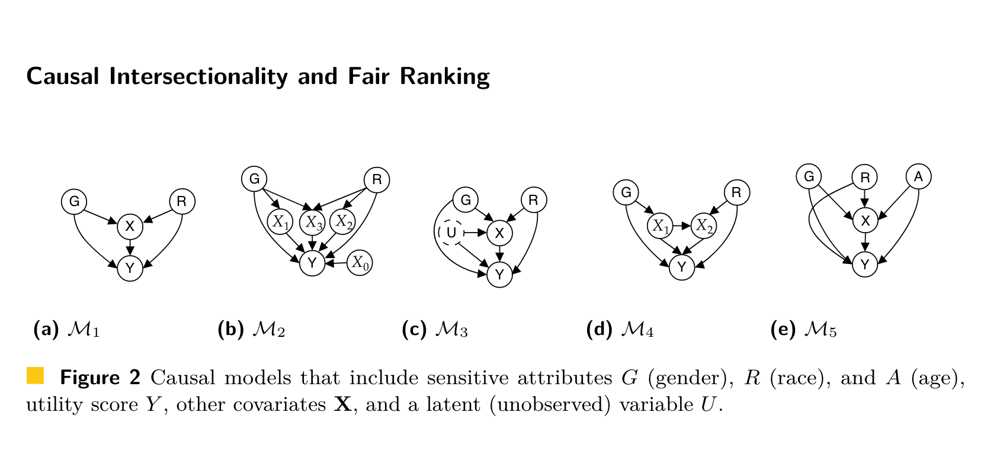

```{r setup, include=FALSE}
knitr::opts_chunk$set(echo = FALSE)
```

## On Fairness, Equality, and Power

In a really illuminating paper, [Kasy and Abebe](https://dl.acm.org/doi/10.1145/3442188.3445919) argue that some of the leading definitions of fairness imply the original, unconstrained goals of the algorithm designer themselves must be fair. The paper has other interesting results, like using implied welfare weights to show who are the greatest beneficiaries of an algorithm. But in this post I'll focus on their **Observation 1**, which I briefly summarize next.

**Background**: The designer wishes to make (yes/no) decisions on the basis of merit $M$--we can also think of this as qualification, just desert, utility, or some similar concept. Whatever we call this variable, it's what the designer really cares about, and it's rarely measured directly. So, the algorithm designer uses machine learning methods with some predictor variable(s) $X$, and presumably some proxy/surrogate outcome $Y$ which stands in for the unmeasured $M$, and then makes decisions using the predictions $\hat f(x) \approx \mathbb E[Y | X = x]$. For simplicity we can assume the decision variable $W$ is binary, and takes the form of thresholding, i.e. $W(x) = 1$ if and only if $\hat f(x) > c$, some constant (marginal cost of the decision).

**Fairness**: Now let's say we have a sensitive attribute $A$, and we take the very common approach to fairness by requiring calibration of the predictions:

$$\mathbb E[\hat f(x) | W = 1, A = a] = \mathbb E[\hat f(x) | W = 1]$$

In words: among those who receive the decision $W = 1$, the estimated proxy for merit has the same average value, regardless of the sensitive attribute $A$.

**Observation 1**: If the algorithm could predict $M$ perfectly, then (we would not have to use a proxy $Y$ for it, and also) it would automatically satisfy this fairness definition.

This isn't a novel observation, it's usually stated as one of the trivial cases in impossibility theorems, but Kasy and Abebe ask us to think again about its implications. Take statistical error and measurement problems out of the picture and we realize that fairness is defined using whatever notion of merit that the algorithm designer chooses. 

## Causal connection (in progress)

## Links

[Slides](slides/causal.html) for my own talk

[Conference page](https://maxkasy.github.io/home/ML_inequality_conference/)

[Youtube channel](https://www.youtube.com/channel/UCB3VHmtU-Acta1o0wbzWaag)


[Causal Intersectionality and Fair Ranking](https://arxiv.org/abs/2006.08688)

