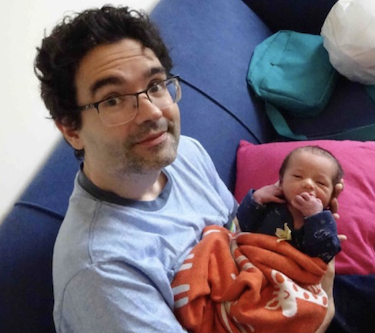
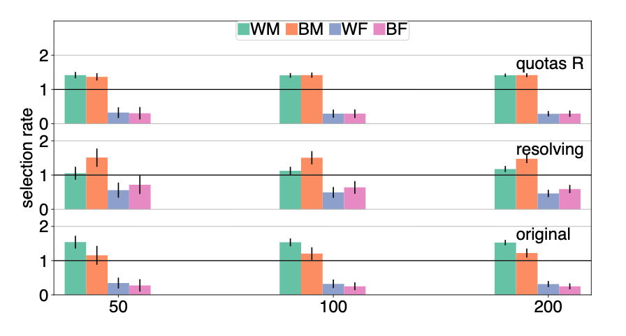
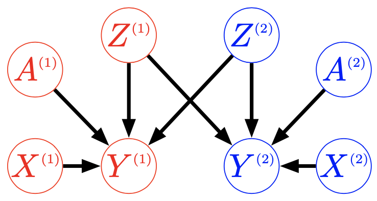
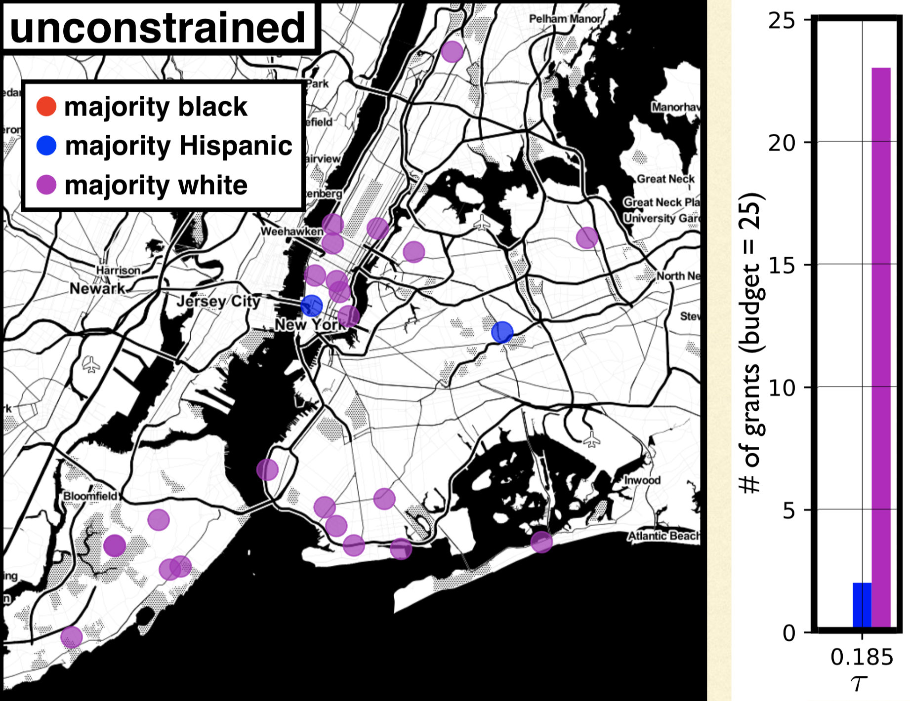

class: split-four

```{r setup, include=FALSE}
options(htmltools.dir.version = FALSE)
knitr::opts_chunk$set(fig.retina = 3, warning = FALSE, message = FALSE)
options(knitr.table.format = "html")
```

```{r xaringan-themer, include=FALSE, warning=FALSE}
library(xaringanthemer)
style_duo_accent(
  primary_color = "#2d708e",
  secondary_color = "#230433",
  link_color = "#55c667",
  text_bold_color = '#f68f46',
#  title_slide_text_color = "#444444",
  title_slide_background_color = "#ffffff", #"#042333",
  title_slide_background_image = "../../../files/theme/LSE/LSEcrest_large.jpg",
  title_slide_background_size = "cover",
  ) #or contain
```

```{r xaringanextra, include=FALSE, warning=FALSE}
#library(xaringanExtra)
#xaringanExtra::use_animate_all("slide_left")
#xaringanExtra::use_tile_view()
#xaringanExtra::use_panelset()
#xaringanExtra::style_panelset_tabs(font_family = "inherit")
```

```{r tidyverse, include=FALSE, warning=FALSE}
library(tidyverse)
library(knitr)
theme_set(theme_minimal(base_size = 22))
set.seed(1)
library(broom)
library(modelr)
```

<style type="text/css">
.remark-slide-content {
    font-size: 1.2rem;
    padding: 1em 4em 1em 4em;
}
</style>


.column[

Matt Kusner (UCL)
&nbsp; 

&nbsp; 


Julia Stoyanovich
]

.column[

Chris Russell (AWS/ELLIS)

&nbsp; 


Ke Yang
]

.column[


Ricardo Silva (UCL)

&nbsp;  


Lucius Bynum
]

.column[
## Turing group

&nbsp; 

&nbsp; 

&nbsp; 

### NYU

Margarita Boyarskaya

]


---

### Starting in 2016

**Weapons of Math Destruction** by Cathy O'Neil

[ProPublica](https://www.propublica.org/article/how-we-analyzed-the-compas-recidivism-algorithm):


---

### Serious business

.pull-left[
"New products and services, including those that incorporate or utilize **artificial intelligence and machine learning**, can raise new or exacerbate existing *ethical, technological, legal*, and other challenges, which **may negatively affect our brands** and demand for our products and services and **adversely affect our revenues** and operating results"
]
.pull-right[


Source: [WIRED](https://www.wired.com/story/google-microsoft-warn-ai-may-do-dumb-things/), Feb. 2019.

]

---

### Back in 2016

I thought: seems like this is about causality? ("effect" of one variable, "controlling for" others)

Holland: **no causation without manipulation**


Well, what *can* we manipulate?

---

.small[
**Are Emily and Greg More Employable than Lakisha and Jamal?** (Bertrand and Mullainathan, 2003)

Whitened Resumes: Race and Self-Presentation in the Labor Market (Kang et al, 2016)

*Systemic Discrimination Among Large U.S. Employers* (Kline et al, 2022)
]


---

Randomize (or blind) the **perception** of a sensitive variable (e.g. race) at one (late?) time point


---

### Berkeley graduate admissions example

> The bias in the aggregated data stems **not from any pattern of discrimination on the part of admissions committees**, which seem quite fair on the whole, but apparently from **prior screening at earlier levels** of the educational system. Women are shunted by their **socialization and education** toward fields of graduate study that are generally more crowded, less productive of completed degrees, and less well funded, and that frequently offer poorer professional employment prospects.

From the final paragraph of Bickel et al (1975)

#### What information / covariates should we condition on?

---

### Directed Acyclic Graph (DAG) models


- Assumption: paths show conditional dependence
- Assumption: intervention to change one variable also affects all variables on paths away from it


---

### (Infamous?) policing example

"Algorithm does not *explicitly* use race" -- in an unfair world, **other things can correlate with race**, e.g. prior convictions

.pull-left[
```{r echo = FALSE}
library(DiagrammeR)
mermaid("
graph LR
  R-->M
  S-->M
  S-->P
  M-->P
  P-->C
")
```
]

.pull-right[
Race $R$, structural racism $S$, arrested for marijuana $M$, prior conviction $P$, risk score $C$

If $C$ is computed using only $P$ (and not $R$ *directly*), is that "fair"?
]

---

### Fairness focused on one (later?) stage

- *perception* of race/gender
- balance *among applicants*

#### does not fix unfairness that occurred earlier

**Counterfactuals** help us think about this. **Depth** of the counterfactual story (starting earlier in time and/or length of causal pathway) corresponds to more/less fairness

VanderWeele and Robinson, 2015:

> ... we tried to [...] provide a causal interpretation of the race coefficient in regression models that would be palatable to someone who was opposed to discussing causal effects for non-manipulable variables.

---

## Defining fairness causally

Kusner, Loftus, Russell, Silva. *Counterfactual fairness* ([NeurIPS 2017](https://papers.nips.cc/paper/2017/hash/a486cd07e4ac3d270571622f4f316ec5-Abstract.html)):

Given a DAG, the predictor $\hat Y$ is **counterfactually fair** if

$$P(\hat Y_a | x, a) = P(\hat Y_{a'} |x, a)$$


#### Proposition (sufficient, not necessary):
Any predictor $\hat Y$ which is a function of only non-descendents of $A$ in the DAG is counterfactually fair


---

### Pathway analysis / decomposition

.pull-left[


- [Kilbertus et al (2017)](https://papers.nips.cc/paper/2017/hash/f5f8590cd58a54e94377e6ae2eded4d9-Abstract.html): proxies and **resolving variables**

]


.pull-right[
- [Kusner et al (2017)](https://papers.nips.cc/paper/2017/hash/a486cd07e4ac3d270571622f4f316ec5-Abstract.html): path-dependent counterfactual fairness (see supplement)
- [Zhang et al (2017)](https://www.ijcai.org/proceedings/2017/549)
- [Nabi and Shpitser (2018)](https://ojs.aaai.org/index.php/AAAI/article/view/11553)
- [Zhang and Bareinboim (2018)](https://aaai.org/ocs/index.php/AAAI/AAAI18/paper/view/16949/0)
- [Chiappa (2019)](https://ojs.aaai.org//index.php/AAAI/article/view/4777)
- ...

]


---

### At some point we must decide

#### Which version of fairness to achieve?

**(Simplified) impossibility theorem** see, e.g.: Kleinberg et al (2016), Chouldechova (2016) 

> Unless the world is already fair, the only solutions satisfying both equal treatment (or opportunity) and equal outcomes (demographic parity) are trivial ones (e.g. jail everyone)


---

### At some point we must decide

#### Which causal model reveals our beliefs?

[George Box](https://en.wikipedia.org/wiki/George_E._P._Box):


> [All models are wrong](All_models_are_wrong) but some are useful

therefore,

> ... the scientist must be alert to what is **importantly wrong**

> ... **cannot obtain a "correct" one** by excessive elaboration


---
class: split-four

### Every DAG is (importantly?) wrong

.column[
&nbsp; 

```{r echo = FALSE}
library(DiagrammeR)
mermaid("
graph TB
  Race-->Outcome
")
```
]
.column[
&nbsp; 

```{r echo = FALSE}
library(DiagrammeR)
mermaid("
graph TB
  Racism-->Outcome
")
```
]

.column[
&nbsp; 


```{r echo = FALSE}
library(DiagrammeR)
mermaid("
graph TB
  A-->X
  X-->Y
  A-->Y
")
```
]
.column[
&nbsp; 

```{r echo = FALSE}
library(DiagrammeR)
mermaid("
graph TB
  A-->X
  A-->R
  X-->Y
  R-->Y
  A-->Y
")
```
]

&nbsp;

&nbsp;

&nbsp;

&nbsp;

&nbsp;

&nbsp;


**Transparency**: we can say specifically what we disagree on

**Interpretation**: meanings of variables, edges (mechanisms)


---

### Impossibility: competing DAGs / pathways

*When Worlds Collide: Integrating Different Counterfactual Assumptions in Fairness* (Russell et al, [NeurIPS 2017](https://papers.nips.cc/paper/2017/hash/1271a7029c9df08643b631b02cf9e116-Abstract.html))

- Approximate counterfactual fairness (relax equality constraint)
- Approximately satisfy fairness across both (all) models
- Limitation: the more contradictory are the competing models, the more trivial the predictions (constant)
- Causal framing of fundamental contradiction

#### Resolving the contradiction
I think this is a good *path*. It's now about understanding the causes of unfairness well enough to reach consensus.

---

## [Intersectional](https://en.wikipedia.org/wiki/Intersectionality) fairness

*Causal Intersectionality and Fair Ranking* (Yang, Stoyanovich, Loftus, [FORC 2021](https://drops.dagstuhl.de/opus/portals/lipics/index.php?semnr=16187))

- Multiple sensitive attributes, e.g. race and gender

- Variety of relationships with other mediating variables

- Some of these mediators may be resolving/non-resolving for different sensitive attributes

Lots of scholarship, not much using formal mathematical models. See [Bright et al (2016)](https://www.journals.uchicago.edu/doi/abs/10.1086/684173), 
[O'Connor et al (2019)](https://www.tandfonline.com/doi/abs/10.1080/02691728.2018.1555870), and a few other references in our paper


---

## "Moving company" example

.pull-left[
Race, gender, weightlifting test, application score
```{r echo = FALSE, fig.align='right'}
library(DiagrammeR)
mermaid("
graph TB
  R-->X
  G-->X
  R-->Y
  X-->Y
  G-->Y
")
```
]
.pull-right[
Weightlifting considered a **resolving variable** (company argues it is a necessary qualification)

```{r, echo=FALSE, out.width="100%", fig.align='center'}

```

(See paper for results)
]


---

### Untangling intersectional relationships

*Race as a Bundle of Sticks* (Sen and Wasow, 2016)

Causal mediation with **multiple mediators** and **multiple causes** is a hard problem, limiting realistic application until better methods/data are available


---

## Interventions under [interference](https://en.wikipedia.org/wiki/Spillover_(experiment%29)

> Various models have only predicted the world in various ways. The point, however, is to change it

*Making Decisions that Reduce Discriminatory Impacts* (Kusner et al [ICML 2019](http://proceedings.mlr.press/v97/kusner19a.html))

- Designing an optimal policy / intervention / allocation 

- Relaxing common assumption that intervention on individual/unit $i$ does not effect other individuals/units (in fairness/justice applications that will often be **importantly wrong**)

- Constraint: bound **counterfactual privilege**, preventing "rich get richer" effect

---

### Optimal fair policies (under interference)

.pull-left[
Intervention $\mathbf Z$ trying to increase $\mathbf Y$

Privilege constraint, for $\tau \geq 0$
$$
\mathbb{E}[\mathbf{\hat Y}({\color{red}a},\mathbf{Z})] - \mathbb{E}[\mathbf{\hat Y}({\color{blue}a'},\mathbf{Z})] \leq \tau
$$
]
.pull-right[

]

Optimization problem (with budget constraint $b$)

$$\mathbf{Z} = \arg \max \sum_i \mathbb{E}\left[\mathbf{\hat Y}^{(i)}(a^{(i)}, \mathbf Z) | \mathbf A^{(i)}, \mathbf X^{(i)}  \right]$$

$$\quad s.t. \quad \sum_i \mathbf{Z}^{(i)} \leq b$$
---

### Allocating resources to (NYC) schools

.pull-left[
Without constraint

]
.pull-right[
With constraint

]

(See paper for discussion of results)

---

### Exciting advances in causal modeling

Observational data, double machine learning, causal reinforcement learning, ...

### Applications in ethical data science

Prioritizing normative values: fairness, privacy, interpretability, replicability, "alignment," ...


#### Coming soon

*Counterfactuals for the Future* (Bynum et al, AAAI 2023)


---

### Bet on causality

Claim: **causality** points us in good directions for research

- Choosing which covariates to condition on in fair prediction/decisions
- Changing focus from prediction to action, interventions, policy design, etc
- Making models/assumptions transparent

Deirdre Mulligan at (NeurIPS 2022) causal fairness workshop:

> the important role [causal models] can play in supporting **collaborative reasoning about contested concepts, facilitating stakeholder participation** in decisions about how to meet policy goals within technical systems

---

### Parting wisdom (hard won, not by me)

Remember pragmatism, Box's rule, and what's **important** and what's **useful**? (to who? for what?)


### Thank you for listening!

Reading for a fairly general audience: The long road to fairer algorithms ([Nature, 2020](https://www.nature.com/articles/d41586-020-00274-3))

[joshualoftus.com](joshualoftus.com) slides and other info


