class: split-four

```{r setup, include=FALSE}
options(htmltools.dir.version = FALSE)
knitr::opts_chunk$set(fig.retina = 3, warning = FALSE, message = FALSE)
options(knitr.table.format = "html")
```

```{r xaringan-themer, include=FALSE, warning=FALSE}
library(xaringanthemer)
style_duo_accent(
  primary_color = "#2d708e",
  secondary_color = "#230433",
  link_color = "#55c667",
  text_bold_color = '#f68f46',
#  title_slide_text_color = "#444444",
  title_slide_background_color = "#ffffff", #"#042333",
  title_slide_background_image = "../../../files/theme/LSE/LSEcrest_large.jpg",
  title_slide_background_size = "cover",
  ) #or contain
```

```{r xaringanextra, include=FALSE, warning=FALSE}
library(xaringanExtra)
#xaringanExtra::use_animate_all("slide_left")
#xaringanExtra::use_tile_view()
#xaringanExtra::use_panelset()
#xaringanExtra::style_panelset_tabs(font_family = "inherit")
```

```{r tidyverse, include=FALSE, warning=FALSE}
library(tidyverse)
library(knitr)
theme_set(theme_minimal(base_size = 22))
set.seed(1)
library(broom)
library(modelr)
```

<style type="text/css">
.remark-slide-content {
    font-size: 1.2rem;
    padding: 1em 4em 1em 4em;
}
</style>


### Credit to my excellent collaborators

#### Alan Turing Institute (2016-)

```{r echo = FALSE, fig.show='hold'}
knitr::include_graphics(c("ricardo.png", "matt.jpg",  "chris.png"))
```

Ricardo Silva, Matt Kusner (UCL) &nbsp; Chris Russell (AWS)

---

#### NYU (2020-) Julia Stoyanovich, Ke Yang, Lucius Bynum

```{r echo = FALSE, fig.show='hold', out.width="25%"}
knitr::include_graphics(c("julia.png", "ke.jpg", "lucius.png"))
```


#### LSE (2022-) Sakina Hansen

```{r echo = FALSE, fig.show='hold', out.width="30%"}
knitr::include_graphics(c("sakina.jpg"))
```

---

## Outline

- Unfair algorithms: examples and background

- Statistical fairness

- (Structural) causal models

- Counterfactual fairness

- Auditing (black-box) algorithms

- Causal interpretability

---
class: center, middle, inverse

# Unfair algorithms

## Examples and background


---

### Origin story of my research (2016-)

**Weapons of Math Destruction** [book](https://en.wikipedia.org/wiki/Weapons_of_Math_Destruction) by Cathy O'Neil

[ProPublica](https://www.propublica.org/article/how-we-analyzed-the-compas-recidivism-algorithm) data journalism:

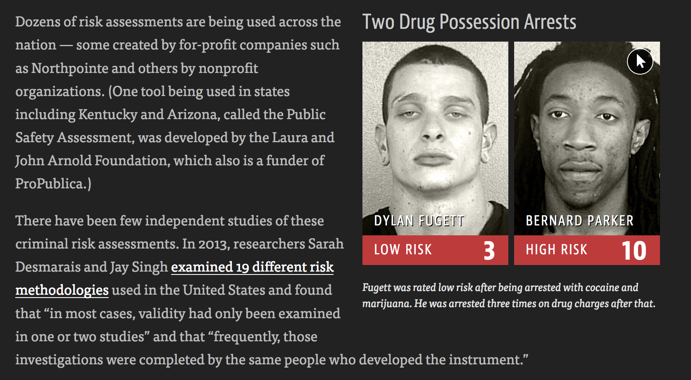
---

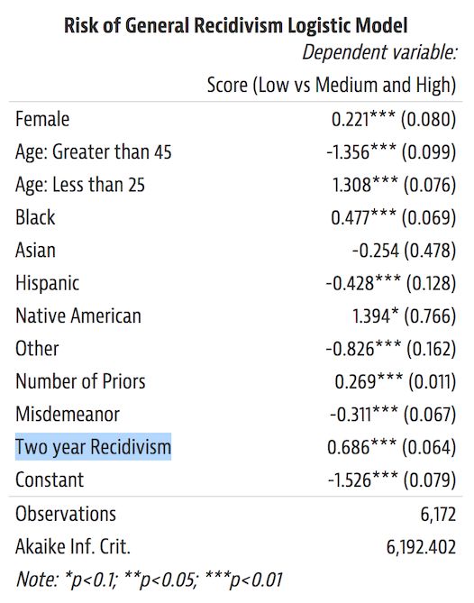


---

### AI and healthcare patient data

.pull-left[

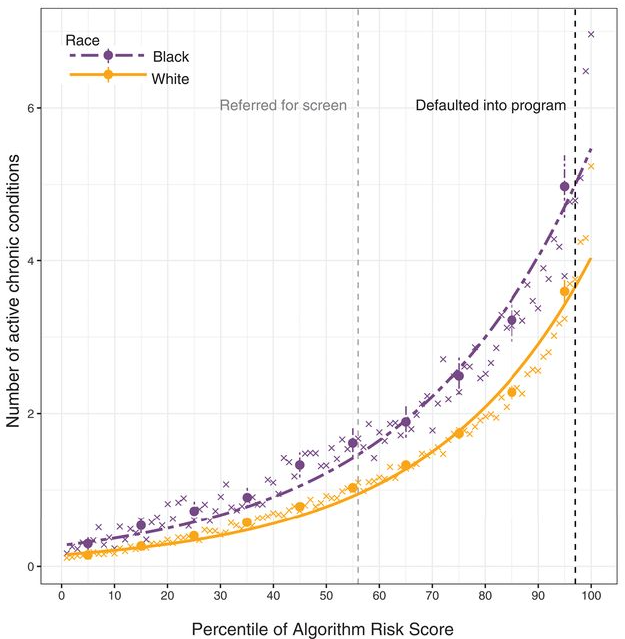

]
.pull-right[

[Obermeyer et al (2019)](https://science.sciencemag.org/content/366/6464/447.editor-summary)

- Algorithm assigns risk scores by **predicting healthcare costs** from patient records
- Underestimates risk of health conditions for black patients compared to white patients
- **Adjusting algorithm** to close the gap results in ~2.5x black patients receiving more care

]

---

### Language models

Statistical patterns of words occurring close to each other

**Causality**: model does not know *why* words are correlated

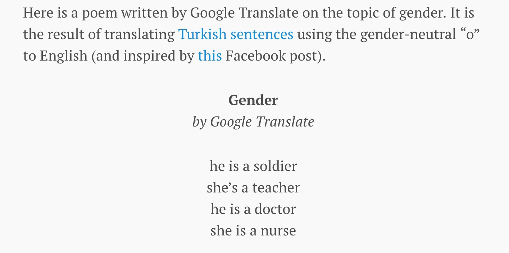
... "he is hardworking, she is lazy" [source link](https://qz.com/1141122/google-translates-gender-bias-pairs-he-with-hardworking-and-she-with-lazy-and-other-examples)

---

### [LLMs](https://www.washingtonpost.com/technology/2023/04/05/chatgpt-lies/) and exponential growth of [bullsh*t](https://aisnakeoil.substack.com/p/chatgpt-is-a-bullshit-generator-but)

> One night, [...] law professor Jonathan Turley got a troubling email. As part of a research study, a fellow lawyer [Eugene Volokh] had asked ChatGPT to generate a list of legal scholars who had sexually harassed someone. Turley’s name was on the list.

> [...] Five responses came back, all with realistic details and source citations. But [...] three of them appeared to be false. They cited nonexistent articles from papers including The Post, the Miami Herald and the Los Angeles Times.

> [Later `r emo::ji("airplane")`,] Microsoft’s Bing, [...] repeated the false claim about Turley — citing among its sources an op-ed by Turley [...] outlining his experience of being falsely accused by ChatGPT.

---

### Serious business

.pull-left[
"New products and services, including those that incorporate or utilize **artificial intelligence and machine learning**, can raise new or exacerbate existing *ethical, technological, legal*, and other challenges, which **may negatively affect our brands** and demand for our products and services and **adversely affect our revenues** and operating results"
]
.pull-right[
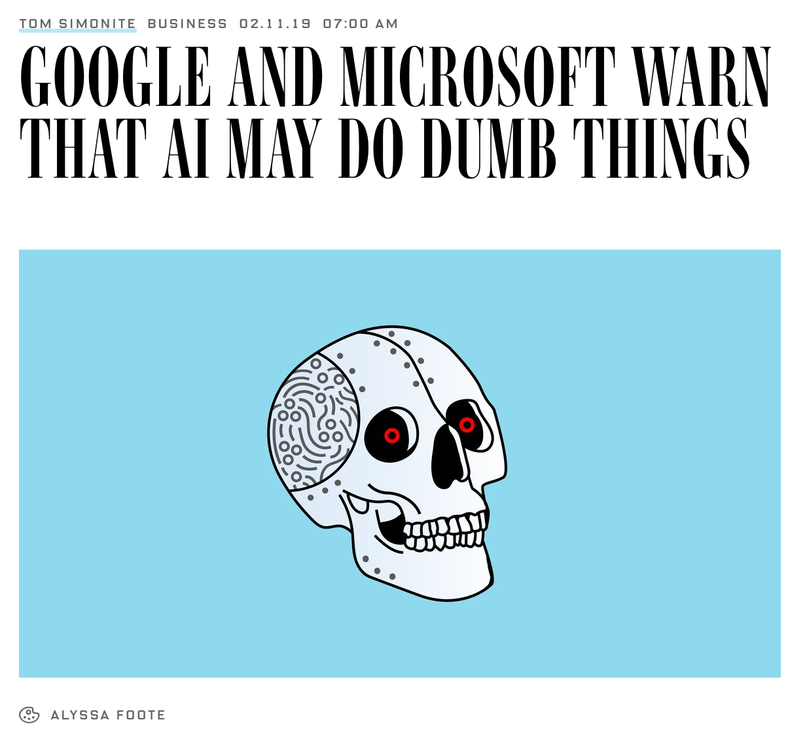

Source: [WIRED](https://www.wired.com/story/google-microsoft-warn-ai-may-do-dumb-things/), Feb. 2019.

]


---

### Not an entirely new problem!

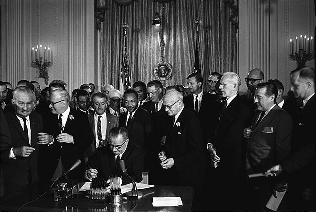

See [50 Years of Test (Un)fairness: Lessons for Machine Learning](https://dl.acm.org/doi/10.1145/3287560.3287600) (Hutchinson and Mitchell, 2019) 


---

#### Background: race and wealth in the US

Source: [W. E. B. Du Bois](https://www.smithsonianmag.com/history/first-time-together-and-color-book-displays-web-du-bois-visionary-infographics-180970826/) for Paris World Fair in 1900

.pull-left[
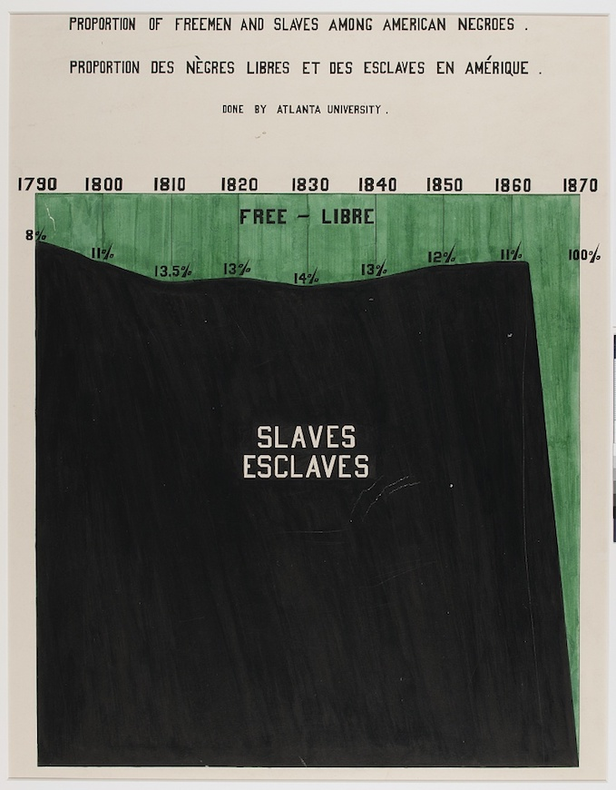
]
.pull-right[

]

---

#### Background: race and wealth in the US

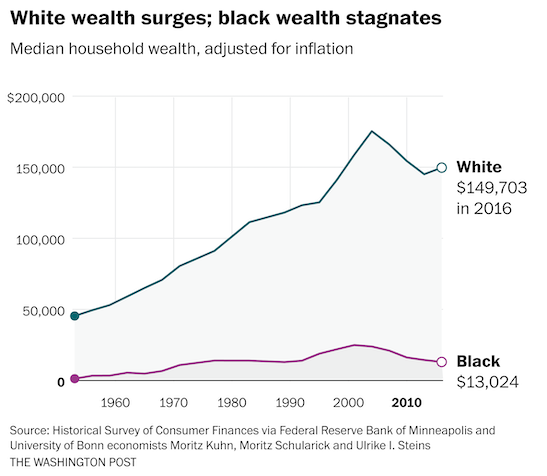 [Source](https://www.washingtonpost.com/business/2020/06/04/economic-divide-black-households/)

---

# How to get wealthy

--

1. Inheritance (entirely luck)
2. Employment (trade your life) and some luck

*Simple as*

---

.small[
**Are Emily and Greg More Employable than Lakisha and Jamal?** (Bertrand and Mullainathan, 2003)

Systemic Discrimination Among Large U.S. Employers (Kline et al, 2022)

*Whitened Resumes: Race and Self-Presentation in the Labor Market* (Kang et al, 2016)
]

 [Source](https://hbswk.hbs.edu/item/minorities-who-whiten-job-resumes-get-more-interviews)

---

#### Background: race and policing in the US

.pull-left[
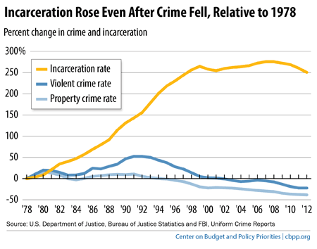
Above [source](https://okpolicy.org/surprisingly-weak-link-incarceration-crime/)

Right [source](http://econweb.umd.edu/~tuttle/files/tuttle_mandatory_minimums.pdf)
]
.pull-right[
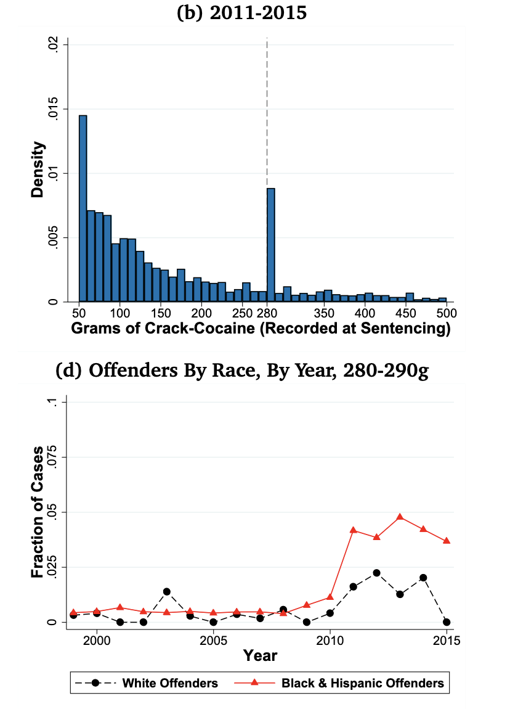
]
---

#### Background: gender and education

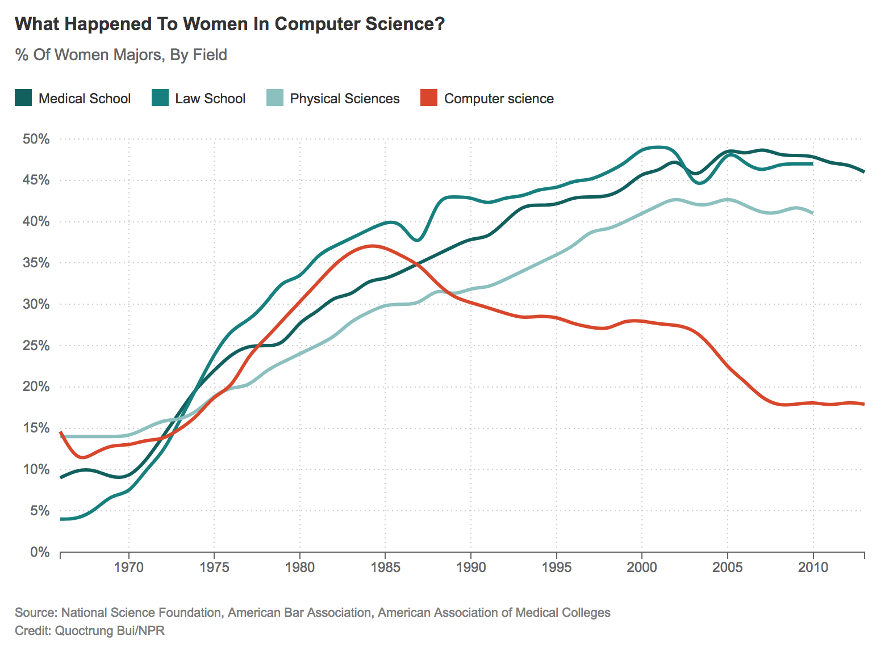
---


#### Background: gender and employment

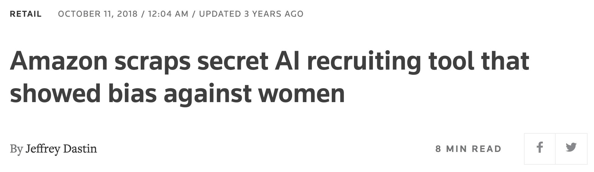

> Amazon’s system **taught itself** that male candidates were preferable. It penalized resumes that included the word "women's," as in "women's chess club captain." And it downgraded graduates of two all-women's colleges, according to people familiar with the matter.

[Source](https://www.reuters.com/article/us-amazon-com-jobs-automation-insight-idUSKCN1MK08G)

---

#### Background: gender and employment

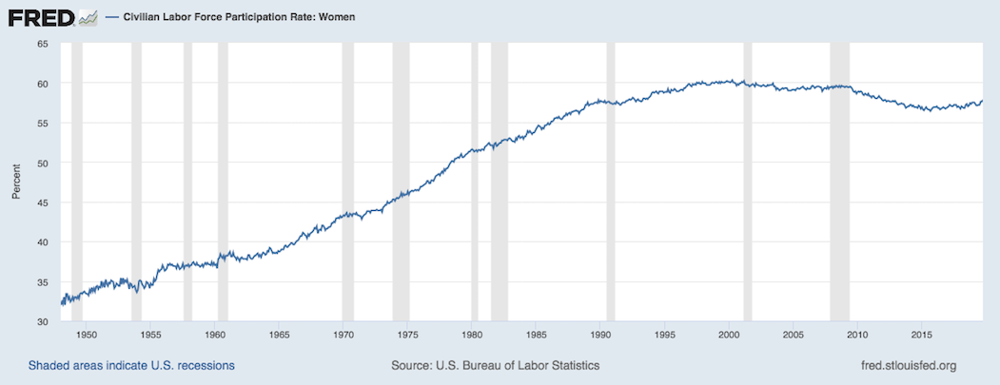

[Source](https://fred.stlouisfed.org/series/LNS11300002)

*Imagine* debating about "human nature" in 1950...

(this ends the time series part of the talk)

---

### Background: spatial discrimination


[Redlining](https://en.wikipedia.org/wiki/Redlining): (dis)advantaged status *correlates* with location

---

### Background: spatial discrimination

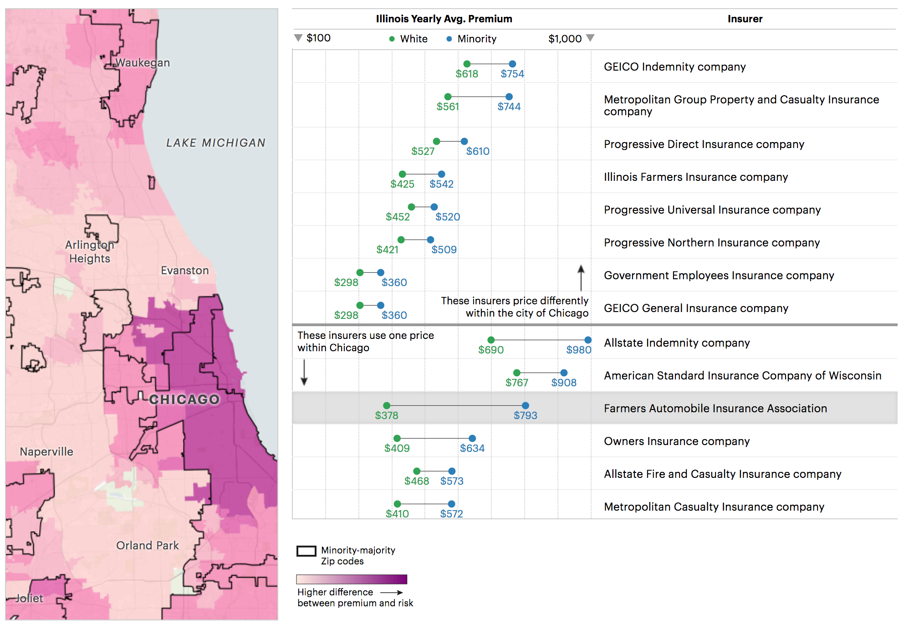

---

### At some point we must decide

#### Which (causal) model reveals our beliefs?

[George Box](https://en.wikipedia.org/wiki/George_E._P._Box):


> [All models are wrong](All_models_are_wrong) but some are useful

--

therefore,

> ... the scientist must be alert to what is **importantly wrong**

> ... **cannot obtain a "correct" one** by excessive elaboration

---

### At some point we must decide

#### Which version of fairness to achieve?

**(Simplified) impossibility theorem** see, e.g.: Kleinberg et al (2016), Chouldechova (2016) 

> Unless the world is already fair, the only algorithms satisfying both equal treatment (or opportunity) and equal outcomes (demographic parity) are trivial ones (e.g. jail everyone)

(More about these fairness definitions coming up next)

---

class: center, middle, inverse

# Statistical discrimination

---

### Notation: fairness in supervised learning

- Outcome variable $Y$, consider as a score for decisions, or $Y = 1$ as the desirable decision
- Sensitive/protected attribute(s) $A$, e.g. race, gender, ...
- Other predictors $X$, not sensitive (*prima facie*)

--

Machine learning task: learn a function $f(X,A)$ from (labeled) training data to predict values of $\hat Y = f(X,A)$ on (unlabeled/future) test data (by minimizing some loss function that measures closeness of $\hat Y$ to $Y$ on the training data)

--

What would it mean for such function to be fair with respect to $A$?

---

## Statistical / demographic parity

Perhaps the most straightforward definition (and my favorite), often described as **equality of outcomes**

#### Demographic parity 
Predictions (or decisions) are independent of $A$:
$$
P(\hat Y | A = 0) = P(\hat Y | A = 1)
$$

---

## Equality of opportunity

#### Equality of opportunity (Hardt et al, 2016)
The accuracy of the algorithm does not depend on $A$:
$$
P(\hat Y = 1 | A = 0, Y = 1) = P(\hat Y = 1 | A = 1, Y = 1)
$$
Demographic parity but only among individuals 'qualified' for the desirable outcome

---

## Fairness through unawareness

"Equal treatment," people tend to believe such treatment is fair.

#### Grgic-Hlaca et al. (2016)
Prediction does not explicitly use $A$, i.e.
$$
\hat Y = f(X)
$$

---

## Individual fairness

#### Dwork et al. (2012)
Similar predictions for individuals who are similar (in their unprotected attributes). If $X_i \approx X_{i'}$ then

$$\hat Y(X_i, A_i) \approx \hat Y(X_{i'}, A_{i'})$$

Continuity-like condition but not in $A$. Intuitively related to privacy and also matching approaches to causal inference.

---

class: center, middle, inverse

# Break time

[Slides for part 2](tutorial2.html)

