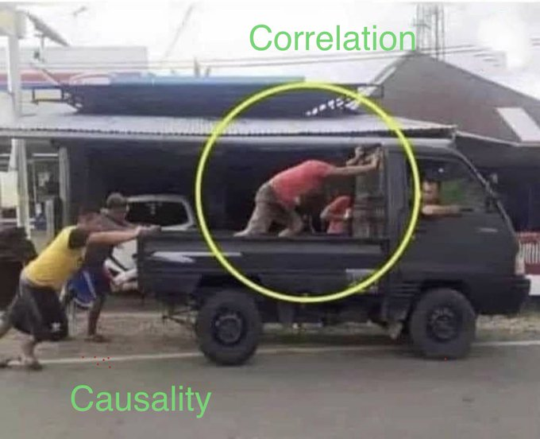

```{r setup, include=FALSE}
options(htmltools.dir.version = FALSE)
knitr::opts_chunk$set(fig.retina = 3, warning = FALSE, message = FALSE)
options(knitr.table.format = "html")
```

```{r xaringan-themer, include=FALSE, warning=FALSE}
library(xaringanthemer)
style_duo_accent(
  primary_color = "#2d708e",
  secondary_color = "#230433",
  link_color = "#55c667",
  text_bold_color = '#f68f46',
#  title_slide_text_color = "#444444",
  title_slide_background_color = "#ffffff", #"#042333",
  title_slide_background_image = "../../../files/theme/LSE/LSEcrest_large.jpg",
  title_slide_background_size = "cover",
  ) #or contain
```

```{r xaringanextra, include=FALSE, warning=FALSE}
library(xaringanExtra)
#xaringanExtra::use_animate_all("slide_left")
xaringanExtra::use_tile_view()
xaringanExtra::use_panelset()
xaringanExtra::style_panelset_tabs(font_family = "inherit")
```

```{r tidyverse, include=FALSE, warning=FALSE}
library(tidyverse)
library(knitr)
theme_set(theme_minimal(base_size = 22))
set.seed(1)
library(broom)
library(modelr)
```

<style type="text/css">
.remark-slide-content {
    font-size: 1.2rem;
    padding: 1em 4em 1em 4em;
}
</style>

[Causality](https://twitter.com/whitesphd/status/1308094245669081089) is about making things happen




---

### Directed Acyclic Graph (DAG) models

Fairness / gender balance of graduate school admissions


- Assumption: intervention to change one variable also affects all variables on paths away from it

---

## How do we get a DAG?

Simple examples are easy to understand

Too simple? Don't correspond to the real world?

### How do we know if it's "true"?

My opinion: we could use a healthy dose of (philosophical)

> [Pragmatism](https://en.wikipedia.org/wiki/Pragmatism) is a philosophical tradition that considers words and thought as *tools and instruments for prediction, problem solving, and action*, and rejects the idea that the function of thought is to describe, represent, or mirror reality.

---

### Statistical wisdom: models as (thinking) tools

.pull-left[

[George Box](https://en.wikipedia.org/wiki/George_E._P._Box)
]

.pull-right[

> [All models are wrong](All_models_are_wrong) but some are useful

therefore,

> ... the scientist must be alert to what is **importantly wrong**

> ... **cannot obtain a "correct" one** by excessive elaboration

]


---
class: split-four

### Every DAG is (importantly?) wrong

.column[
&nbsp; 

```{r echo = FALSE}
library(DiagrammeR)
mermaid("
graph TB
  Race-->Outcome
")
```
]
.column[
&nbsp; 

```{r echo = FALSE}
library(DiagrammeR)
mermaid("
graph TB
  Racism-->Outcome
")
```
]

.column[
&nbsp; 


```{r echo = FALSE}
library(DiagrammeR)
mermaid("
graph TB
  A-->X
  X-->Y
  A-->Y
")
```
]
.column[
&nbsp; 

```{r echo = FALSE}
library(DiagrammeR)
mermaid("
graph TB
  A-->X
  A-->R
  X-->Y
  R-->Y
  A-->Y
")
```
]


Transparency: we can say specifically what we disagree on (sometimes denote sensitive attribute $A$)

&nbsp;

&nbsp;

&nbsp;

&nbsp;

&nbsp;

[Kusner et al (2017)](https://papers.nips.cc/paper/2017/hash/a486cd07e4ac3d270571622f4f316ec5-Abstract.html),
[Kilbertus et al (2017)](https://papers.nips.cc/paper/2017/hash/f5f8590cd58a54e94377e6ae2eded4d9-Abstract.html),
[Nabi and Shpitser (2018)](https://ojs.aaai.org/index.php/AAAI/article/view/11553),
[Zhang and Bareinboim (2018)](https://aaai.org/ocs/index.php/AAAI/AAAI18/paper/view/16949/0),
[Chiappa (2019)](https://ojs.aaai.org//index.php/AAAI/article/view/4777), and a growing list of others

---
class: inverse, center, middle

My goal: use causal modeling tools to understand--and help the community learn--what might be importantly wrong in data science pipelines

In particular, addressing problems of (statistical) bias and ethical consequences

**Using DAGs to be less wrong**

---

## [Intersectional](https://en.wikipedia.org/wiki/Intersectionality) fairness

Yang, Stoyanovich, Loftus. *Causal Intersectionality and Fair Ranking* ([FORC 2021](https://drops.dagstuhl.de/opus/portals/lipics/index.php?semnr=16187))

- Multiple sensitive attributes, e.g. race and gender

- Variety of relationships with other mediating variables

- Some of these mediators may be resolving/non-resolving for different sensitive attributes

Lots of scholarship, not much using formal mathematical models. See [Bright et al (2016)](https://www.journals.uchicago.edu/doi/abs/10.1086/684173), 
[O'Connor et al (2019)](https://www.tandfonline.com/doi/abs/10.1080/02691728.2018.1555870), and a few other references in our paper


---

### Untangling intersectional relationships

Causal mediation with **multiple mediators** and **multiple causes** is a hard problem, limiting realistic application until better methods/data are available

#### Opportunity for statistical research


---

# "Bet" on causality

Claim: **causality** points us in good directions for research

- Choosing which covariates to condition on in fair prediction/decisions

- Changing focus from prediction to action, interventions, policy design, etc

- Making models/assumptions transparent

---


### Thank you for listening!

Reading for a fairly general audience: The long road to fairer algorithms ([Nature, 2020](https://www.nature.com/articles/d41586-020-00274-3))

[joshualoftus.com](joshualoftus.com) 

